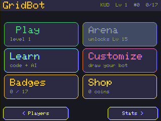
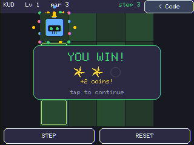
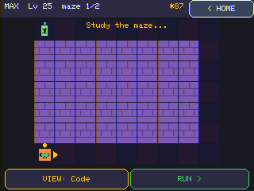
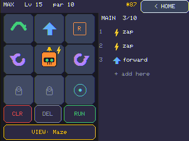
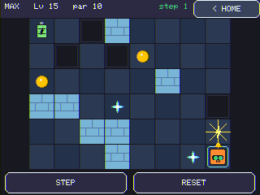
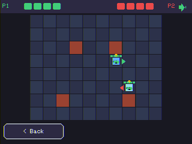
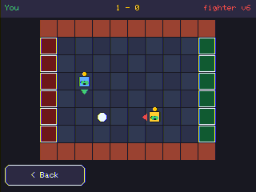
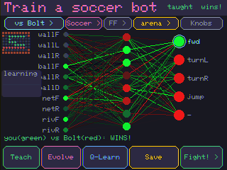
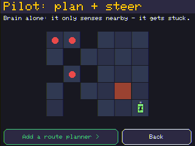
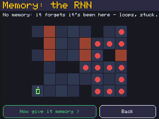

# GridBot — teach a kid to code, one maze at a time

**A pocket-sized "program your robot through the maze" game for the $10 Cheap Yellow
Display.** Kids snap together commands — *forward, turn, jump, loop, function, sense, zap* —
hit **RUN**, and watch their little robot try to reach the battery. It bonks a wall? They
fix one line and try again. It never ends, it gets harder, and new powers unlock as they
climb. And once they've mastered *writing* the rules, a late-game **NeuroBot** mode
graduates them to *training* them — backprop, Q-learning, evolution, and transfer learning,
all on the same $10 board.

|  |
|:--|
| **Write a program, watch it run.** Your robot reaches the green **battery** by following the commands you snap together, dropping a glowing **breadcrumb trail** so you can see exactly where it went. Brick walls block you, dark squares are pits you fall into (or **jump**), and the robot's little arrow shows which way "forward" is — everything is relative to *its* heading, which is the whole point: kids learn to think like the robot. |

> ### ⚡ [**Flash it from your browser →**](https://jamesdavid.github.io/cyd-GridBot/)
> Got a CYD? Plug it in and install GridBot straight from Chrome/Edge — no clone, no
> toolchain. (Powered by ESP Web Tools; see the [flasher page](docs/index.html).)
> **Need the board?** [Grab a CYD (ESP32-2432S028R) on Amazon](https://a.co/d/05H98aWQ) (~$10–15).

> ### 👩‍🏫 Parent or teacher? [**The Grown-Up Guide →**](docs/HANDBOOK.md)
> A handbook to sit beside the game: the big idea + questions to ask for every lesson, a
> classroom track (with the radio for student/teacher interaction), an "is this *really* how
> AI works?" honesty appendix, and a standards map. No coding or AI background needed.

---

## Why GridBot exists — *a robot you can hold, not one more app*

Coding for kids usually means a tablet app or a website. GridBot puts it on a **real
object you can hold** — a cheap touchscreen you can leave on a shelf, hand to a kid, and
say "get the robot to the battery." No account, no internet, no ads. Just a robot, a maze,
and the dawning realisation that *you can tell it exactly what to do.*

The magic moment GridBot is built around: a kid writes
`repeat until at-goal { if wall-ahead, turn; forward }` once, and it solves a maze it has
**never seen** — then *another* maze, and another. That's not memorising a path. That's an
**algorithm**. A seven-year-old just discovered the wall-follower. The whole difficulty
curve is designed to lead there — and then, at the very end, to flip it: once you can
*write* the rules, GridBot teaches you to *grow* them with a neural net.

### Why not just use a tablet app?

- **It's a thing, not a tab.** Dedicated cheap hardware that lives in the real world beats
  one more icon on a locked-down tablet. It feels like a gadget, because it is one.
- **Relative control teaches sequencing.** The robot moves along *its own heading*, so
  "forward" depends on where it's facing — kids have to run the program in their head.
  (An absolute N/S/E/W pad would be easier and teach nothing; we deliberately don't.)
- **It grows with the kid.** Each new power gets a gentle, guaranteed-win intro level, then
  ramps: forward → Jump → Repeat → **Sensing** (`if`) → Functions → a whole
  **machine-learning** mode. A 5-year-old and a 12-year-old both have something to chew on.
- **It's a real piece of engineering on a $10 board.** Always-solvable procedural mazes, an
  explicit-stack interpreter (no recursion, fully steppable), on-device neural nets with
  hand-rolled backprop, a pixel-art editor, an ESP-NOW radio link, and a from-scratch UI —
  all on a no-PSRAM ESP32.

---

## Feature tour — *every screen, every power*

### Pick a player — *whose robot is this?*

|  |
|:--|
| **Choose a Player.** Each kid gets their own robot, level, stars, coins, and badges — saved to flash, so it's all there next time. Tap a card to play; tap the big **STATS / EDIT** strip for everything else. Plus a **New Player** card and a one-tap **music on/off** toggle. |

|  |
|:--|
| **Make a robot.** A big-key **QWERTY** keyboard (tuned for finger-on-resistive-glass), a name up to 8 letters, and a row of **eight differently-coloured robots** to pick from. Each kid also gets a hidden global ID so two GridBots can recognise each other over the radio. |

|  |
|:--|
| **One menu, everything one tap away.** Picking (or making) a player lands here — not buried in a maze. **Play** jumps to your current level; **Arena**, **Learn** (CodeLab + NeuroLab), **Customize** (the pixel editor), **Badges**, and **Shop** are each a single tap. The header shows your level, stars, and badge count; Arena stays locked-but-visible until you reach it, so a kid can *see* what's coming. Every screen's top button returns here. |

### Write code, run it, fix it — *the core loop*

|  |
|:--|
| **The Code view.** Your robot sits in the middle of its own d-pad: tap **↑ forward** and **↺/↻ turn**. The four corners are *growth slots* that fill in as you unlock powers — Jump, Repeat, Call F1, Sense — and the centre robot doubles as the **⚡ zap** button once the Arena opens. The bottom-centre slot becomes **`+brain`** at the NeuroBot tier. New, empty editors literally tell a first-timer what to do (*"tap an arrow to add a step, then tap RUN!"*), and tapping a locked block says when it unlocks. |

|  |
|:--|
| **A real program.** Snap blocks together and they stack up — each colour-coded with its glyph and **hierarchically numbered** (`1, 2, 3 …`, nested steps as `4a, 4b`). Tap a block to edit it: a `repeat` cycles its count **2→3→4→5**, an `if`/`until` cycles its condition (wall → pit → **wall/pit** → goal), a `call` switches **F1↔F2**, a `brain` cycles its mode (plain → **+pilot** → **rnn** → **rnn+pilot**). **Reorder** any line with the **Up/Dn** buttons — so you can drop a block in, then slide it exactly where it belongs — and the top button reads **Menu** (back to the hub) or **< Code** (back to the editor while a run plays). |

|  |
|:--|
| **Study the maze.** Every level opens by showing you the board for a couple of seconds — *learn the layout* — before flipping to the Code view. You can flip back any time with the **VIEW** toggle, or **press-and-hold to peek** without losing your place. (This is the *Nebula* tier — purple space-brick.) |

|  |
|:--|
| **Bonk! Tap to fix.** Run a program that hits a wall or runs out before the battery and the robot stops right where it went wrong, with a clear, gentle message — *"Bonk! a wall — tap to fix."* Tap, and you land back in the Code view with the **exact failing line flashed red**, the **step counter** showing how far it got. Specific, never punishing. Fix one line, run again. |

|  |
|:--|
| **You win!** Reach the battery and you score **1–3 stars** based on how short your program was — looping and functions are *rewarded*, because a `repeat 5` counts as two lines, not five. A **confetti burst** and **star fly-in** celebrate, the win pays out coins, and you can see the robot's path — including the little **arc** it draws each time it *jumps* a pit. Then it's on to the next, slightly harder level — which **pre-loads your winning program**, so a general solver just keeps winning. |

|  |
|:--|
| **It starts gentle.** Level 1 is a guaranteed *forward-only* win — a short straight corridor with the battery dead ahead and a couple of coins. Tap forward a few times, RUN: **three stars and coins**. A brand-new kid is hooked in ten seconds; turns, jumps, and loops ramp in from level 2 on. |

### Powers unlock as you climb — *the toolbox grows with the kid*

|  |
|:--|
| **A title card per level.** Each level opens with a quick card — its number, its **biome** name, and a banner for anything **newly unlocked** (here, *"New: Sensing!"* — the `if` / `repeat-until` tier that makes the never-seen-maze wall-follower possible) or any **badge** you just earned. From the sensing tier on, an **ARENA** button appears here too. |

|  |
|:--|
| **The full toolset** (a NeuroBot-tier level). Every block is lit: **Jump** (leap a pit, L6), **Repeat** (count loops, L10), **Sense** (`if` / `repeat-until`, L15 — the wall-follower payoff), **Functions** (name & reuse steps, L20), the **⚡ zap** button on the robot, and the **`+brain`** slot (L28). The program pane carries **MAIN / F1 / F2** function tabs plus **S▸L / L◂L** to save and load from your solution library. Each new *necessary* mechanic gets a gentle, guaranteed-win intro level first. |

|  |
|:--|
| **One program, many mazes.** Every few levels past Sensing is a **generalization** challenge — one program must clear 2–3 *different* boards (note the "maze 1/2" in the chrome). Because your code carries over between levels, a wall-follower you wrote once just… keeps solving boards it has never seen. This is the payoff the whole curve is built toward: *that's an algorithm.* |

### Stats & badges — *proof you're getting good*

|  |
|:--|
| **Stats.** Level reached, total stars, win rate, bonks/falls, streak, a **NeuroBot** line (brains trained / levels won with a brain / fighters saved), and a **command-usage bar chart** so you can see which powers a kid leans on — locked ones greyed with *when* they unlock. Up top: **Badges N/17** (tap to open the gallery). From here you can **Edit** name/colour, **Draw** a custom sprite, open the **Shop**, or (behind two confirmations) delete the player. |

|  |
|:--|
| **17 badges to collect.** First Steps, Bright Spark (3 stars), Hopper (your first Jump), Looper, Architect (a Function), Sixth Sense, Champion (an arena win), On Fire (5-streak), Unstoppable (10-streak), Explorer (Lv 10), Veteran (Lv 20), Artist (draw a sprite), Star Collector, the **NeuroBot** trio — **Brainiac** (train a brain), **Mind Over Maze** (clear a level *with* a brain), **Battle-Ready** (save a brain as an Arena fighter) — and **Generalist** (train one brain that clears a gauntlet of 10 fresh mazes it never saw). Gold = earned; grey = a hint for how to get it. |

### Themed worlds & loot — *the maze changes as you climb*

|  |
|:--|
| **Five biomes** shift the palette as you climb — **Meadow → Cavern → Glacier → Circuit → Nebula** — so progress *feels* like a journey, not just a counter. This is the green Meadow, with gold coins dotted along the route. |

|  |
|:--|
| **Grab loot on the way to the goal.** Gold **coins** sit right on the route — scoop them up for spendable currency. Bright cyan **gems** are the real prize: they sit on a *detour off the path*, so you have to steer your robot out of its way to grab one — and collecting every gem on a board pays an **all-clear bonus**. Spend it all in the **shop** on robot colours and emojis. |

### Draw your own robot — *make it yours*

|  |
|:--|
| **A KidPix-style pixel editor.** Draw your own 16×16 **character** *and* **goal** with pencil / eraser / fill / **mirror**, an 8-colour palette, and a big red **BOOM** button that blows the canvas up (with a sound) when you want to start over. Your custom robot then shows up in the actual game — and can be **traded to a friend** over the radio. |

### Arena — *pit your bots against each other*

Three games on one deterministic match engine: **Race** (first to the goal), **Soccer** (shove a
ball into the net), and **Battle** (Sumo — last bot standing). Every one is playable by a bot you
**coded** with `if`-blocks *or* one you **trained** as a neural net — and any of them can be run as
a one-off match, a local **Tournament**, or a multi-device **Room**.

|  |
|:--|
| **Arena** (battling unlocks at the **Sense** tier — once you can write `if` conditions you can code a fighter; neural *training* unlocks later). **Opponent first, then game.** Pick who you're playing — **vs Computer**, **Hotseat** (two kids, one device), **Radio** (two CYDs: battle, trade, or join a multi-device **Room** tournament), or **Train a fighter** — then the game. Computer offers **Race** / **Soccer** / **Battle** (Sumo, last bot standing) / **Tournament** (a **Cup** knock-out bracket or a round-robin **Ladder** of your saved fighters, run deterministically and replayed match-by-match on screen); Hotseat adds **Puzzle Race** and **Seed Challenge**. |

|  |
|:--|
| **Battle-bots with personalities.** Face off against **Rusty** ("charges blindly"), **Bolt** ("fast & straight"), **Vex** ("hunts & zaps"), **Ace** ("solves the maze" — a real navigator), or the trained NeuroBots **Neura**, **Cortex**, and **Volt** — each a real **neural fighter** (a distilled hunter brain). The roster **scrolls**, and any bot you save to your **library** — including ones **traded over the radio** — joins it as **your bot** to battle *or* train against. **vs-Computer lets you pick BOTH your bot and your foe** (Vex highlighted as the default), and a big **HP readout** + **ZAP!/OUT! hit bursts** make the brawl easy to read. |

|  |
|:--|
| **Watch it play out, then play again.** Two robots run their programs simultaneously on a shared board, tick by tick — they jostle for the path, collisions bounce them back, a `zap` shoves a rival into a pit. The whole match is **deterministic** (no randomness during play) so a rematch is identical. vs the Computer you face a beatable bot so a kid's robot can actually win, and the result screen has a **"Play again"** so you can instantly retry with a different bot. |

|  |
|:--|
| **Code your own brawler — the robot *is* the zap button.** Once the Arena opens, the robot in the middle of the d-pad gets a **⚡** badge: tap it to add a **`zap`** block. So a kid can build a Sumo fighter in plain code — `repeat { zap; forward }` — not just train a neural one. (No new pad slot needed — the robot does the zapping.) |

|  |
|:--|
| **It animates everywhere, but only bites in the Arena.** On RUN, a zap fires a bright spark into the tile ahead. In a Sumo match that spark **shoves a rival into a pit** (or off the board) for the knockout; in **Soccer** it **swaps your robot with the ball** when you're facing it — a one-move way to get behind the ball and turn it back toward goal; in a maze it's a harmless flash, so it never breaks a campaign run. |

|  |
|:--|
| **Battle (Sumo) — two fighters, one ring.** Last bot standing wins: bots **hunt** each other, **zap** to shove a rival toward a pit or the edge, and a **4-pip HP bar** (with slow regen) makes it a real back-and-forth brawl, not a one-shot. The match is fully **deterministic**, so a rematch replays identically — which is exactly what lets you *compare* fighters fairly. *(GIF: a **Teach→Evolve-trained** fighter vs **Vex**, the hand-coded **hunter** — they close in and trade zaps; captured tick-by-tick on a real CYD. See the [Hand-Coding Guide](docs/HAND-CODING-GUIDE.md) — that same hunter, in plain blocks, beats the trained fighters 9-5-2.)* |

|  |
|:--|
| **Soccer — robots that actually play.** A third Arena game: a **walled pitch** with a goal mouth at each end and a ball in the middle. Step onto the ball and your robot **shoves it one tile** — dribble it into the opponent's net to score. Matches are **timed and multi-goal** with a live **scoreline** up top; after each goal the ball **kicks off to a fresh spot** so a match never deadlocks into two bots shoving the same square. It's the same `10 → 8 → 5` brain as everything else — it just senses the **ball** as its objective and the **goal** and **rival** as bearings — so you can **Teach / Q-Learn / Evolve** a soccer bot, *or* hand-code one with the new `ball-ahead` / `net-left` sense blocks and **and/or** conditions. There's even a pre-trained **house team** with soccer names — Strika, Dribbla, Volley, Nutmeg, Boots — and soccer drops straight into **Hotseat, Tournaments, and the networked Room**. Each bot's arrow is tinted to **match the net it attacks** (green → green goal, red → red), so it's easy to read who's scoring. *(GIF: a striker trained with a **self-goal penalty** vs the previous champion — each buries a clean goal in the correct net, 1–1, no own-goals — captured tick-by-tick on a real CYD.)* |

|  |
|:--|
| **The same brain, re-sensed.** Flip the trainer to its Brain Cam in soccer mode and the `10 → 8 → 5` network is *literally the same one* a maze-solver or a fighter uses — only the **senses are relabelled**: `ballF/ballR/ballD` (where's the ball, relative to me), `netF/netR` (which way's the goal), `rivF/rivR` (the rival). The `zap` output even greys to **`-`**, because there's no zapping on the pitch. It's the clearest on-device proof of *one brain, many jobs* — a maze brain, a brawler, and a striker are the identical shape trained on different objectives. |

|  |
|:--|
| **Radio friend (ESP-NOW).** Two GridBots within range can **battle** — both screens run the *same* deterministic match from a shared seed — or **trade**, Pokémon-style: send a friend your favourite bot (and your custom robot art) and get theirs into your library. The multi-device **Room tournament** (every board's fighter gathered into one shared bracket, replayed from a shared seed) is **verified on two boards**; the 1:1 battle/trade path is built and wants a focused two-board pass. |

|  |
|:--|
| **Puzzle Race — same maze, beat the clock.** You're not driving, you're **programming**: it uses the **exact same block editor** as the campaign (control pad, loops, `if`s, real F1/F2 functions, nested blocks) plus a **"see the maze"** peek. Both players get the *same* board and 90 seconds to write a program (hotseat — Player 1 locks in, then passes the device). Nearest to the goal wins. "Can you out-*code* your friend?" |

|  |
|:--|
| **The result.** Each player is scored by BFS distance — **0 = reached the battery**, otherwise "N tiles away." Nearest wins; equal coders tie. Tap **Again** for a fresh shared board. |

### CodeLab — *a lesson for every block*

|  |
|:--|
| **Two tracks of bite-size lessons.** **CodeLab** teaches the programming blocks — *you write the rules* — and **NeuroLab** teaches machine learning — *you train the rules*. A clean on-ramp to each half of the game. |

|  |
|:--|
| **CodeLab** has a runnable lesson for each core block, in unlock order — **Move**, **Jump**, **Repeat**, **Sense** (`if`), **Functions**, **Brain** (neurosymbolic: code + a trained net), and **Debug** (read the failure, change one line, re-run) — seven in all. |

|  |
|:--|
| **Each lesson is a tiny *runnable* demo.** A one-line explanation, a small maze, and a pre-built program — rendered in the **same block style as the real editor** (matching glyphs, colours, nested brackets, so there's no "different look" to relearn). Tap **Run** and watch the robot solve it, with a friendly **"solved it!"** at the end. |

> **📘 Bridge: the [Hand-Coding Guide](docs/HAND-CODING-GUIDE.md).** Before training brains, write
> them by hand. This walkthrough builds a competitive bot *with blocks* for all three Arena games —
> the maze **wall-follower**, the battle **hunter**, the soccer **dribbler** — then plays each against
> a trained neural bot and shows, with measured results, **which jobs hand-coding wins and which need
> AI**: Maze & Battle reward a clear rule (a 3-rule wall-follower solves **8× more unseen mazes**; the
> hunter goes **9-5-2** vs trained fighters), while Soccer is where *learning* pulls ahead (the best
> hand-coded dribbler **ties some** trained strikers but **loses to others**, and the strongest beats
> it 80–352). It's the hands-on on-ramp from *"I write
> the rules"* to *"I train the rules"* — kids earn NeuroLab by feeling exactly where rules run out.

### NeuroBot — *stop writing the rules, start training them*

> A late-game **graduation** (unlocks at **level 28**, a few levels after Sensing — you learn
> `if` logic first, *then* move on to training it). GridBot teaches *you write the rules*;
> **NeuroBot teaches you grow them** — the contrast between symbolic and learned AI is itself
> the lesson. It reuses the whole engine: the same maze, editor, Arena, and radio trade.

|  |
|:--|
| **NeuroLab** — seventeen lessons, each small enough to *watch*: one neuron, backprop, **perception** (the senses we hand the brain), a hidden layer, many actions, **your robot's brain** (a tour of its real senses), data & labels, Q-learning, **Tuning the grid** (the explore/step knobs on a tabular Q table), **Tuning a real net** (learn rate + rounds on a live MLP — watch the loss fall, or *thrash*), **evolution** (population → fitness → selection → **crossover** → mutation: "the best robots make robot babies"), **transfer learning**, **Brain Cam**, **Pilot** (plan + steer), **Memory** (a recurrent brain), **Self-play** (train by beating yourself), and **The Right Tool** (match the method to the problem). |

|  |
|:--|
| **Backprop.** A neuron guesses, sees how wrong it is, and nudges its weights. Each of the **4 situations** is spelled out in words (`WALL pit → TURN`), so you can see *why* it trains toward go/turn/turn/turn: any wall **or** pit → turn. Tap **Train** and watch the error bar fall and every example flip **✗ → ok**, all the way to *"learned!"* |

|  |
|:--|
| **Why a hidden layer?** A real bot decision: **turn at a corner** — turn when *exactly one* side is open, but go straight in a corridor (both walls) or a junction (both open). A single neuron *provably* cannot learn this (it's the classic **XOR** — the classes aren't linearly separable); add a hidden layer and watch the loss finally collapse to zero. A hands-on proof of *why* deeper networks exist, framed as something the robot actually does. |

|  |
|:--|
| **Meet your robot's brain.** A three-page tour of the *actual* NeuroBot brain — **10 senses** (walls, pit, and the *direction & distance* to the goal and to an enemy, all signed & relative to the robot's heading: minus = behind/left), **8 hidden neurons**, **5 actions** (forward / turn L / turn R / jump / **zap**). The punchline: it's **one brain for every job** — the same `10 → 8 → 5` network solves mazes *and* fights in the Arena. |

|  |
|:--|
| **Reinforcement (Q-learning).** No code, no teacher: the robot tries the maze over and over and **value spreads back from the battery**, with arrows showing the policy it discovered — reward, exploration vs. exploitation, all visible. |

|  |
|:--|
| **Evolution.** A herd of random brains; the ones that get furthest **breed**. Watch the best one's path improve and the fitness curve climb, generation by generation — selection and inheritance you can actually see. |

|  |
|:--|
| **A brain is a block in your program.** Drop a **`brain`** into the normal editor next to your loops and `if`s — *neurosymbolic* programming: explicit code for the easy parts, a trained brain for the tricky bit. It drops in **already wrapped in `repeat until at goal { brain }`**, with a **`train brain >`** line right underneath. |

|  |
|:--|
| **The neuro interface — with transfer learning.** Open it from the **`train brain >`** line. **Teach** it (distil the optimal solver by backprop — reliable) or **Evolve** it, watch its path solve the maze, then **Use it**. Pick a **base** to fine-tune from — start fresh or **load a saved brain** and build on what it knows — and **save a copy as an incremented version** (`Brain v1 → v2 → …`), so you can grow a *lineage*. The trained brain saves *with* your program, so it persists and **trades & battles over the radio**. Tap the **neuron widget** in the top bar and the trainer unfolds the very same **Brain Cam network graph** for *your* program's brain — inputs → hidden → outputs, weights recolouring as you Teach — then folds back to the maze. |

|  |
|:--|
| **Transfer learning, as its own lesson.** Train a brain on maze A, then **carry it over to a new maze B** — it starts far ahead of a random brain and only needs a little fine-tuning. The same trick the editor's **base** picker uses, and why a maze brain can graduate into an Arena fighter. |

|  |
|:--|
| **Brain Cam — watch a brain *learn* and *think*.** A live inspector for the network. Tap **Teach** and watch **backprop animate**: the connection lines are coloured by weight (green +, red −) and **recolour as it learns**, with an epoch counter and a loss bar that fills as the loss falls. Then **Run** it and the **10 inputs** (SEES), **hidden layer** (THINKS), and **5 outputs** (DOES, winner ringed) light up step-by-step. **Tap any neuron** to zoom in on its **bias and incoming weights** as they update. Flip **plain ↔ rnn** to see a recurrent brain's memory loop (every hidden neuron's feedback to itself *and* every other — drawn as real arcs), and cycle **Map N** to watch the *same* brain **transfer** onto a different real maze. **Save** what you train straight to your **library**, so a brain you grew here can graduate into an Arena fighter. The clearest possible answer to "what is the network actually doing?" |

|  |
|:--|
| **Pilot — plan + steer (the self-driving split).** A brain only senses what's *nearby*, so on a twisty maze it gets stuck. Add a **route planner**: it lays down **waypoints** (the dots) and the same brain just steers dot-to-dot — and now it solves it. The **planner decides *where*, the brain decides *how*** — exactly how a self-driving stack splits a *map route* from the *neural net that handles the road*. A pilot-trained brain clears the whole campaign that a bare reactive brain can't. |

|  |
|:--|
| **Memory — the brain that remembers (an RNN).** Pilot gave the brain an *outside* planner; this gives it its *own* memory. A plain brain picks `action = f(senses **now**)`, so in a dead-end it forgets it's been there and **loops** (red). A **recurrent** brain picks `action = f(senses now **+ memory**)` — it remembers its trail, **backs out, and solves it** (green). The only change is a **feedback path**: the hidden layer feeds back into itself (an **8×8 weight matrix** that a plain brain keeps at 0). Same maze, same teacher; only the one with memory gets through. Trained on-device by **backprop-through-time**. |

|  |
|:--|
| **Train a fighter for the Arena.** A **"Train a fighter"** mode off the Computer branch: **Teach** (imitate a hunter), **Q-Learn** (reward only — win/lose), or **Evolve** a brain to **win real arena matches**, and a **Memory (RNN)** toggle to give it a recurrent brain. A **"spar vs"** chip cycles your sparring partner easy→hard — the blind dasher **Bolt**, the wall-huggers **Coil** & **Spin** (left- and right-hand rule, so they take different routes), the hunter **Vex**, the perfect solver **Ace**, then **Self** (it spars against an evolving copy of *itself* — an arms race), then every bot in your **library** (incl. radio-traded ones) — so a first Teach reliably reads *"taught WINS!"* and you can climb to a real challenge. A live **learning-curve sparkline** shows whether it's actually improving, and an optional **"Knobs" panel** tucks away three real hyperparameters — **learning rate**, **rounds**, and **explore** (mutation/epsilon) — for the kid who wants to feel what each does (paired with the *Tune a real brain* lesson). **Save** it and it joins your roster as **your bot** — and it **fine-tunes to each new battle board** at match start, so a trained fighter actually wins instead of over-fitting. |

**The ML ideas a kid actually meets here** — not as jargon, but as things you *do* and *watch*:
gradient-descent **backprop**; **multi-class** outputs (argmax picks the action); why a
**hidden layer** is needed (it cracks **XOR**); **reinforcement learning** (tabular Q, reward,
explore-vs-exploit); **neuroevolution** (fitness, selection, breeding); **imitation learning /
distillation** (copy an expert solver); **transfer learning & fine-tuning**; a **shared
feature representation** (one network for two jobs); **generalization / over-fitting**
(a brain trained on one board that flounders on another — visible as the step counter marches
to the cap, and fixed by fine-tuning); **planning vs. control** (a route planner feeds the
brain waypoints — the self-driving split); and **memory / recurrence** (an RNN that escapes
dead-ends a memoryless brain loops in).

---

## Under the hood — *the engineering that makes it work*

- **Always-solvable procedural mazes.** Every level is generated from `hash(player, level)`
  — never stored — by carving a guaranteed solution path, decorating with walls/pits at
  difficulty-scaled density, and BFS-verifying. The first level of each *necessary* mechanic
  (forward, jump) is a hand-tuned gentle intro so a brand-new kid always gets an early win.
- **A real interpreter.** Programs are an AST (commands, `repeat n`, `repeat-until`, `if`,
  `call F1/F2`, and a `brain` node). Execution uses an **explicit call stack**, not C++
  recursion, so it's steppable and memory-bounded, with a step cap for runaway loops.
- **One editor, one AST, everywhere.** The control pad + nested program list is a reusable
  component shared by the campaign, Puzzle Race, and the CodeLab lessons. Player programs,
  saved library scripts, and AI opponents are the *same* AST shape — so a bot you build in
  the campaign drops straight into the Arena. A **trained brain is just another node**
  (`N_NEURO`); the arena reads each bot's *effective* move so a brain's `zap` shoves a rival
  exactly like a code bot's does.
- **On-device machine learning.** A from-scratch **MLP with hand-rolled backprop**, **tabular
  Q-learning**, **neuroevolution**, and **distillation** — all in fixed memory (no heap, no
  TensorFlow). Brains train on-device fast enough to *watch*, serialize **with** the program,
  and so persist, trade, and battle like any other bot.
- **Tiny art, big personality.** Robots and batteries are vector-drawn (a few hundred bytes
  of code, scalable to any tile size), plus optional 16×16 custom sprites — no SD card.
- **Made for fingers on glass.** ≥40px touch targets, debounced taps, a chiptune menu theme +
  win fanfare + badge chime, and an RGB LED that flashes green on a win and red on a fail.
- **Robust persistence.** Profiles, stats, badges, the resume slot, the library, and custom
  sprites are JSON on LittleFS, rebuilt-index-on-write so an interrupted save can't brick the menu.
- **A headless dev loop.** A USB-serial screenshot + tap-injection harness
  (`scripts/shot.py`, `scripts/drive.py`) drives and photographs the whole UI without a
  finger — every screenshot and GIF in this README was captured that way.

---

## Get one running — *flash it in two minutes*

GridBot runs on the **CYD (Cheap Yellow Display, ESP32-2432S028R)** — a ~$10–15 touchscreen
([grab one on Amazon](https://a.co/d/05H98aWQ)). The fastest path is the
[**browser flasher**](https://jamesdavid.github.io/cyd-GridBot/) — plug in, click, done.
From source:

```bash
git clone <this repo> && cd cyd-GridBot
# PlatformIO (see HARDWARE_SETUP.md for the venv path on Windows)
platformio run -e cyd_gridbot -t upload --upload-port <your port>
```

Full build instructions, the parts list, the toolchain setup, and the board's hard-won
quirks (display orientation, brick-wall colours, touch calibration, the no-PSRAM budget)
live in **[HARDWARE_SETUP.md](HARDWARE_SETUP.md)** so this page stays a showcase.

It is **fully offline** — no WiFi, no accounts, no data leaves the device.

---

## Technical challenges — *overcome & still open*

**Overcome**
- **Always-solvable generation** on a deterministic seed (carve-path → decorate → BFS verify
  → reroll), with fairness rules (the robot never spawns facing a wall; pit gaps only appear
  once Jump is unlocked) and gentle hand-tuned intro levels per mechanic.
- **Steppable interpreter without recursion** — an explicit frame stack drives loops,
  conditionals, and functions, animatable one primitive at a time.
- **One shared editor, three hosts** — the campaign, Puzzle Race, and the lessons all render
  the same blocks without a second code path.
- **A from-scratch UI on a no-PSRAM ESP32** — no framebuffer; dirty-rect tile rendering and a
  one-tile sprite keep RAM tiny (~38% RAM, ~38% flash).
- **A deterministic multi-bot arena** — same inputs → byte-identical match log, proven by
  test, which hands you fair rematches and replays for free.
- **Neural nets on a no-PSRAM ESP32** — a tiny MLP + backprop, Q-learning, evolution, and
  distillation in a few KB, with a learned brain embedded as an interpreter node and trained
  on-device fast enough to animate. **107 host tests** cover the engine.

**Still open / known limits**
- The multi-device **Room tournament** is **verified on two boards** (a soccer Cup replayed to
  the same champion on both) — including **chunked BotCards** so each board brings its *real*
  saved fighter and a lockstep auto-advance. The separate **1:1** ESP-NOW battle/trade path is
  built but still wants a focused two-board pass.
- The campaign editor still carries its own copy of the editor code rather than delegating to
  the shared component (tracked in the backlog).
- The on-screen mini-map and fog levels are reserved but not built.

---

## What's next — *the road ahead*

**Recently shipped:** ✅ a gentle, guaranteed-win **onboarding** (forward-only L1, real
first-time hints, locked-block tooltips) · ✅ **program carry-over** across levels (write one
solver, keep winning) · ✅ a **zap block** (the robot icon) so code bots fight Sumo · ✅ a
kid-friendly **Arena** (opponent-first menu, beatable AI, **pick both bot and foe**, HP
readout + ZAP!/OUT! hit bursts, "Play again" rematch, trained fighters that adapt to each
board) · ✅ **Soccer** — a walled-pitch, push-the-ball, timed-multi-goal Arena game with a live
scoreline, a pre-trained house team, hand-codeable `ball`/`net` senses + **and/or** conditions,
and Teach / Q-Learn / Evolve soccer trainers · ✅ **battling at the Sense tier** — code a fighter
with `if` conditions and save it, no neural training required · ✅ **local tournaments** — a
**Cup** knock-out bracket and a round-robin **Ladder**, run deterministically and replayed on
screen · ✅ a **networked Room tournament** (ESP-NOW) **verified on two boards** — every device's
fighter gathered into one shared bracket and replayed from a shared seed to the same champion ·
✅ the full **NeuroBot**
mode (backprop / Q-learning / evolution **with a breeding explainer** (crossover + "robot babies")
/ transfer / **Tuning the grid** (explore/step knobs) / **Tuning a real net** (learn rate + rounds
on a live net) / **Pilot** (plan + steer, now with **hand-placed waypoints**) / **Memory** (an RNN) /
**Self-play** / **The Right Tool** lessons, Brain Cam with an argmax caption, a learning-curve
sparkline, a trainable brain block with versioned saves) · ✅ neural Arena trainers — **Teach /
Q-Learn / Evolve**, an RNN toggle, a **Self** sparring partner for self-play, and an optional
**Knobs panel** (learning rate / rounds / explore) · ✅ an idle **nametag screensaver** (a big
name card for shared classroom devices) · ✅ a **boot splash** (firmware version + repo) ·
✅ **CodeLab** lessons in the real editor style · ✅ coin & gem collectibles + a shop · ✅ five
**biomes**, a 17-badge gallery, jump-arc animation + a live step counter · ✅ a one-click
**online flasher**.

Still on deck (full list in **[BACKLOG.md](BACKLOG.md)**):

- More **mode types** — relay, co-op, king-of-the-hill — building on Race / Soccer / Sumo /
  Puzzle Race.
- **Gem Hunt** — make gems a *required* objective (collect them all before the goal opens),
  reusing the soccer-style objective sensing so bots can be coded or trained to solve it.
- **Verify the 1:1 radio** battle/trade path on two boards (the multi-device **Room
  tournament** — chunked real fighters, lockstep auto-advance — is already verified there).
- **Daily shared-seed challenges** and a leaderboard.
- Deeper ML topics (regularization/overfitting, reward shaping, batching) building on the
  existing **Tuning**, **draw-the-path**, **Pilot** (planner+follower), **Self-play**, and
  **RNN memory** trainers.
- An optional **mini-map** in the Code view; **Undo** in the editor (reorder already ships as
  Up/Dn).

---

## Status & license

Working firmware, verified on a real CYD — the campaign (all unlock tiers), the arena,
lessons, NeuroBot training, the pixel editor, and achievements all run on hardware. Built
phase-by-phase from `SPEC.md` following `IMPLEMENTATION_STEPS.md`; **107 host unit tests** plus
an on-device self-test gate every change.

**License: [PolyForm Noncommercial 1.0.0](LICENSE).** Free for personal, hobby, research, and
educational use — clone it, build it, modify it, share it. **Commercial use or reselling this
(or derivatives) needs a written license.** Third-party components keep their own licenses:
**LovyanGFX**, **ArduinoJson**, and the Arduino-ESP32 core.

Built with [Claude Code](https://claude.com/claude-code).
