# GridBot — teach a kid to code, one maze at a time

**A pocket-sized "program your robot through the maze" game for the $10 Cheap Yellow
Display.** Kids snap together commands — *forward, turn, jump, loop, function, sense* —
hit **RUN**, and watch their little robot try to reach the battery. It bonks a wall? They
fix one line and try again. It never ends, it gets harder, and new programming powers
unlock as they climb. And once they've mastered *writing* the rules, a late-game
**NeuroBot** mode graduates them to *training* them — backprop, Q-learning, evolution, and
transfer learning, teaching how a neural-net brain actually learns, all on the same $10 board.

| 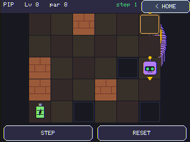 |
|:--|
| **Write a program, watch it run.** Your robot reaches the green **battery** by following the commands you snap together, dropping a glowing **breadcrumb trail** so you can see exactly where it went. Brick walls block you, dark squares are pits you fall into, and the robot's little arrow shows which way "forward" is — everything is relative to *its* heading, which is the whole point: kids learn to think like the robot. (Levels change theme as you climb.) |

> ### ⚡ [**Flash it from your browser →**](https://jamesdavid.github.io/cyd-GridBot/)
> Got a CYD? Plug it in and install GridBot straight from Chrome/Edge — no clone, no
> toolchain. (Powered by ESP Web Tools; see the [flasher page](docs/index.html).)
> **Need the board?** [Grab a CYD (ESP32-2432S028R) on Amazon](https://a.co/d/05H98aWQ) (~$10–15).

---

## Why GridBot exists — *a robot you can hold, not one more app*

Coding for kids usually means a tablet app or a website. GridBot puts it on a **real
object you can hold** — a cheap touchscreen you can leave on a shelf, hand to a kid, and
say "get the robot to the battery." No account, no internet, no ads. Just a robot, a maze,
and the dawning realisation that *you can tell it exactly what to do.*

The magic moment GridBot is built around: a kid writes
`repeat until at-goal { if wall-ahead, turn; forward }` once, and it solves a maze it has
**never seen** — and then *another* maze, and another. That's not memorising a path. That's
an **algorithm**. A seven-year-old just discovered the wall-follower. That's the hook, and
the whole difficulty curve is designed to lead there — and then, at the end, to flip it:
once you can *write* the rules, GridBot teaches you to *grow* them with a neural net.

### Why not just use a tablet app?

- **It's a thing, not a tab.** Dedicated cheap hardware that lives in the real world beats
  one more icon on a locked-down tablet. It feels like a gadget, because it is one.
- **Relative control teaches sequencing.** The robot moves along *its own heading*, so
  "forward" depends on where it's facing — kids have to run the program in their head.
  (An absolute N/S/E/W pad would be easier and teach nothing; we deliberately don't.)
- **It grows with the kid.** Command tiers unlock over the first ~22 levels — Jump, Repeat
  loops, Functions, and Sensing — and then a whole **machine-learning** mode opens up, so a
  5-year-old and a 12-year-old both have something to chew on, on the same device.
- **It's a real piece of engineering on a $10 board.** Always-solvable procedural mazes, an
  explicit-stack interpreter (no recursion, fully steppable), on-device neural nets with
  hand-rolled backprop, a pixel-art editor, an ESP-NOW radio link, and a from-scratch UI —
  all on a no-PSRAM ESP32.

---

## Feature tour — *every screen, every power*

### Pick a player — *whose robot is this?*

| 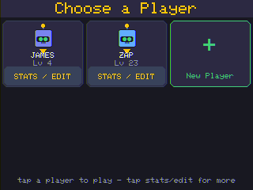 |
|:--|
| **Choose a Player.** Each kid gets their own robot, level, stars, coins, and badges — saved to flash, so it's all there next time. Tap a card to play; tap the big **STATS / EDIT** strip for everything else. Up to six players, plus a **New Player** card and a one-tap **music on/off** toggle. |

| 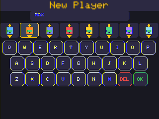 |
|:--|
| **Make a robot.** A big-key **QWERTY** keyboard (tuned for finger-on-resistive-glass), a name up to 8 letters, and a row of **eight differently-coloured robots** to pick from. Each kid also gets a hidden global ID so two GridBots can recognise each other over the radio later. |

### Write code, run it, fix it — *the core loop*

| 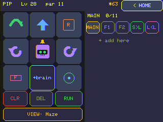 |
|:--|
| **The Code view.** Your robot sits in the middle of its own d-pad: tap **↑ forward** and **↺/↻ turn**. The four corners are *growth slots* that fill in as you unlock powers — here all four are lit: **Jump**, **Repeat**, **Call F1**, and **Sense** — and the bottom-centre slot is the **`+brain`** button (NeuroBot, once unlocked). **CLR / DEL / RUN** sit under the pad; the **MAIN / F1 / F2** tabs and **S▸L / L◂L** library buttons run along the top of the program pane. The centre robot faces the maze's real start direction, so you can reason about "forward" before you run. |

| 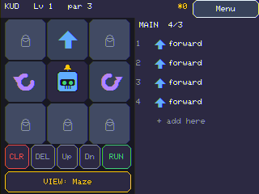 |
|:--|
| **A real program.** Snap blocks together and they stack up in the list — here: *forward, forward, jump, turn R,* then a *repeat 2* loop. Each block is colour-coded with its glyph (loops carry a clear **`R`** badge) and **hierarchically numbered** (`1, 2, 3 …`, with nested steps as `4a, 4b`). Tap a block to select it: a `repeat` shows a big button that **cycles its count 2→3→4→5**, an `if`/`until` cycles its condition. The dim **`+ add inside`** and **`+ add here`** slots make it obvious *exactly where* your next step will land. The list scrolls — no length limit. |

| 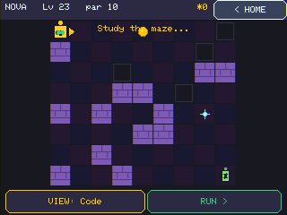 |
|:--|
| **Study the maze.** Every level opens by showing you the board for a couple of seconds — *learn the layout* — before flipping to the Code view. You can flip back any time with the **VIEW** toggle, or **press-and-hold to peek** without losing your place. (This is the *Nebula* tier — purple space-brick.) |

| 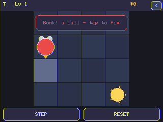 |
|:--|
| **Miss the goal? Tap to fix.** Run a program that bonks a wall or runs out before the battery, and the robot stops right where it went wrong with a clear message — *"Missed the goal — tap to fix."* Tap, and you land back in the Code view with the **exact failing line flashed red**, the **step counter** showing how far it got. Gentle, specific, never punishing. Fix one line, run again. |

| 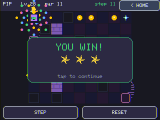 |
|:--|
| **You win!** Reach the battery and you score **1–3 stars** based on how short your program was — looping and functions are *rewarded*, because a `repeat 5` counts as two lines, not five. A **confetti burst** and **star fly-in** celebrate, the win pays out coins, and you can see the robot's path — including the little **upward arc** it draws each time it *jumps* a pit. Then it's straight on to the next, slightly harder level. Forever. |

### Powers unlock as you climb — *the toolbox grows with the kid*

| 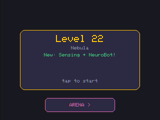 |
|:--|
| **A title card per level.** Each level opens with a quick card — its number, its **biome** name, and a banner for anything **newly unlocked** (here, *"New: Sensing + NeuroBot!"* — the level-22 graduation that opens both the sensing tier *and* the whole machine-learning mode) or any **badge** you just earned. Past the sensing tier, an **ARENA** button appears here too. |

|  |
|:--|
| **The full toolset** (a sensing-tier level). All four corner slots are filled — **Jump / Repeat / Call / Sense** — the **`+brain`** slot is live, and the program pane carries the **MAIN / F1 / F2** function tabs plus **S▸L / L◂L** to save and load from your solution library. Each tier is a real new idea: Jump (leap a pit), Repeat (count loops), Functions (name & reuse steps), and Sense (`if` / `repeat-until` — the robot *reacts*, which is what unlocks the never-seen-maze wall-follower). |

### Stats & badges — *proof you're getting good*

| 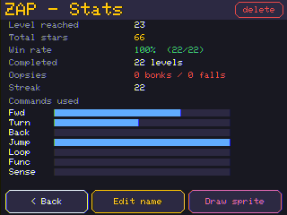 |
|:--|
| **Stats.** Level reached, total stars, win rate, bonks/falls, streak, a **NeuroBot** progress line (brains trained / levels won with a brain / fighters saved, once you reach the ML tier), and a **command-usage bar chart** so you can see which powers a kid actually leans on — locked ones greyed with *when* they unlock. Up top: **Badges 7/16** (tap it to open the gallery). From here you can **Edit** name/colour, **Draw** a custom sprite, open the **Shop**, or (behind two confirmations) delete the player. |

| 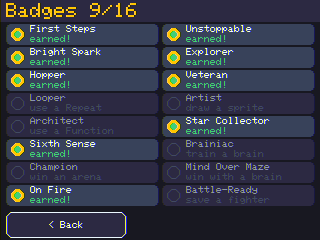 |
|:--|
| **16 badges to collect.** First Steps, Bright Spark (3 stars), Hopper (your first Jump), Looper, Architect (a Function), Sixth Sense, Champion (an arena win), On Fire (5-streak), Unstoppable (10-streak), Explorer (Lv 10), Veteran (Lv 20), Artist (draw a sprite), Star Collector, and the **NeuroBot** trio — **Brainiac** (train a brain), **Mind Over Maze** (clear a level *with* a brain), and **Battle-Ready** (save a brain as an Arena fighter). Gold medal = earned; grey = a hint for how to get it. |

### Themed worlds — *the maze changes as you climb*

|  |
|:--|
| **Meadow** (early levels) — green floors and hedges, with gold coins dotted along the route. Five biomes (**Meadow → Cavern → Glacier → Circuit → Nebula**) shift the palette as you climb, so progress *feels* like a journey, not just a counter. |

### Coins & gems — *loot worth a detour*

| 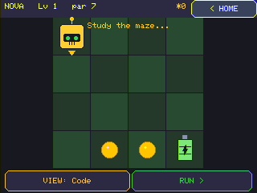 |
|:--|
| **Grab loot on the way to the goal.** Gold **coins** sit right on the route — scoop them up for spendable currency. Bright cyan **gems** are the real prize: they sit on a *detour off the path*, so you have to steer your robot out of its way to grab one — and collecting every gem on a board pays an **all-clear bonus**. Spend it all in the **shop** on robot colours and emojis. |

### Draw your own robot — *make it yours*

| 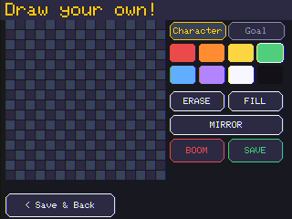 |
|:--|
| **A KidPix-style pixel editor.** Draw your own 16×16 **character** *and* **goal** with pencil / eraser / fill / **mirror**, an 8-colour palette, and a big red **BOOM** button that blows the canvas up (with a sound) when you want to start over. Your custom robot then shows up in the actual game — and can be **traded to a friend** over the radio. |

### Arena — *pit your bots against each other*

| 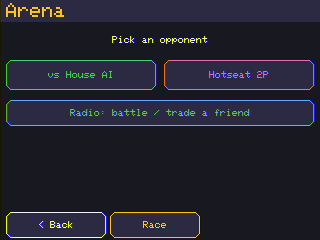 |
|:--|
| **Arena** (unlocks after the sensing tier). **Opponent first, then game.** Pick who you're playing — **vs Computer**, **Hotseat** (two kids, one device), or **Radio** (two CYDs) — then the game. Computer offers **Race** / **Sumo** / **Train a fighter**; Hotseat adds **Puzzle Race** and **Seed Challenge**. In **Sumo** you win by lining up on your rival and **`zap`**-ping them into a pit or off the board's edge. |

| 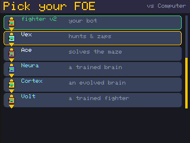 |
|:--|
| **Battle-bots with personalities.** Face off against **Rusty** ("charges blindly"), **Bolt** ("fast & straight"), **Vex** ("hunts & zaps"), **Ace** ("solves the maze" — a real navigator that plots a path on the fly), or the pre-trained NeuroBots **Neura** ("a trained brain") and **Cortex** ("an evolved brain"). The roster **scrolls**, and any program you save to your **library** — including bots **traded over the radio** — joins it as a fighter you can battle *or* train against. |

| 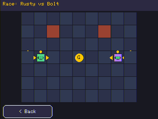 |
|:--|
| **Watch it play out.** Two robots run their programs simultaneously on a shared board, tick by tick — they jostle for the path, collisions bounce them back, and a `zap` shoves a rival into a pit. Here two dashers race to a dead-even **photo finish** (equal bots on a mirrored, fair board correctly tie — a smarter or faster bot wins). The whole match is **deterministic** — no randomness during play — so a rematch is identical and replays are free. |

| 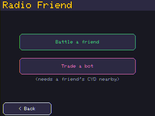 |
|:--|
| **Radio friend (ESP-NOW).** Two GridBots within range can **battle** — both screens run the *same* deterministic match from a shared seed — or **trade**, Pokémon-style: send a friend your favourite bot (and your custom robot art) and get theirs into your library. *(Built; hardware-pending — it needs two physical boards to verify end-to-end.)* |

| 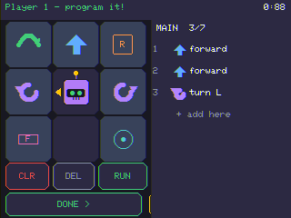 |
|:--|
| **Puzzle Race — same maze, beat the clock.** You're not driving, you're **programming**: it uses the **exact same block editor** as the campaign (control pad, loops, `if`s, functions, nested blocks) plus a **"see the maze"** peek. Both players get the *same* board and **90 seconds** to write a program (hotseat — Player 1 locks in, then passes the device). Each robot then runs and is scored by how close it gets to the goal. "Can you out-*code* your friend?" |

| 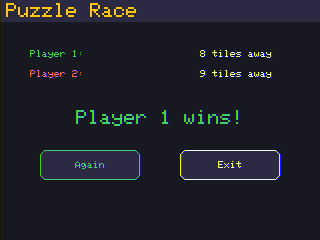 |
|:--|
| **The result.** Each player is scored by BFS distance — **0 = reached the battery**, otherwise "N tiles away." Nearest wins; equal coders tie. Tap **Again** for a fresh shared board. |

### CodeLab — *a lesson for every block*

| 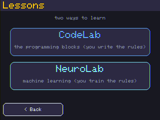 |
|:--|
| **Two tracks of bite-size lessons.** **CodeLab** teaches the programming blocks — *you write the rules* — and **NeuroLab** teaches machine learning — *you train the rules*. A clean on-ramp to each half of the game. |

| 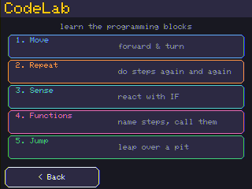 |
|:--|
| **CodeLab** has a lesson for each core block, in unlock order — **Move**, **Jump**, **Repeat**, **Functions**, and **Sense** (`if`). |

| 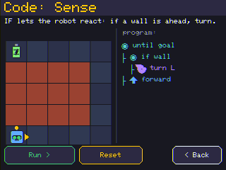 |
|:--|
| **Each lesson is a tiny *runnable* demo.** A one-line explanation, a small maze, and a pre-built program — rendered in the **same block style as the real editor** (matching glyphs, colours, and nested brackets, so there's no "different look" to relearn). Tap **Run** and watch the robot solve it — so you *see* exactly what `repeat 5`, a `call F1`, or a nested `if wall` actually does, with a friendly **"solved it!"** at the end. |

### NeuroBot — *stop writing the rules, start training them*

> A late-game **graduation** (unlocks with the sensing tier). GridBot teaches *you write the
> rules*; **NeuroBot teaches you grow them** — the contrast between symbolic and learned AI is
> itself the lesson. It reuses the whole engine: the same maze, editor, Arena, and radio trade.

| 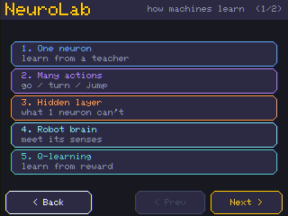 |
|:--|
| **NeuroLab** — eight lessons, each small enough to *watch*: one neuron, many actions, a hidden layer, **your robot's brain** (a tour of its real senses), Q-learning, evolution, **transfer learning**, and **Brain Cam**. |

| 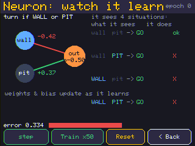 |
|:--|
| **Backprop.** A neuron guesses, sees how wrong it is, and nudges its weights. Each of the **4 situations** is spelled out in words (`WALL pit → TURN`), so you can see *why* it trains toward go/turn/turn/turn: any wall **or** pit → turn. Tap **Train** and watch the error bar fall and every example flip **✗ → ok** — the weights and bias updating live, all the way to *"learned!"* |

| 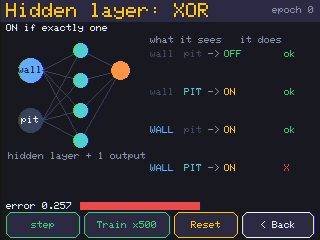 |
|:--|
| **Why a hidden layer?** The same lesson has an **XOR** mode — the classic problem a single neuron *provably* cannot learn (the two classes aren't linearly separable). Add a hidden layer and watch the error finally collapse to zero: a hands-on proof of *why* deeper networks exist. |

| 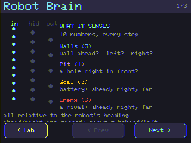 |
|:--|
| **Meet your robot's brain.** A three-page tour of the *actual* NeuroBot brain — **10 senses** (walls, pit, and the *direction & distance* to the goal and to an enemy), **8 hidden neurons**, **5 actions** (forward / turn L / turn R / jump / **zap**). The punchline: it's **one brain for every job** — the same `10 → 8 → 5` network solves mazes *and* fights in the Arena (`zap` simply does nothing outside a battle), which is exactly why a maze brain can be **transfer-learned** into a fighter. |

| 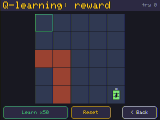 |
|:--|
| **Reinforcement (Q-learning).** No code, no teacher: the robot tries the maze over and over and **value spreads back from the battery**, with arrows showing the policy it discovered — reward, exploration vs. exploitation, all visible. |

| 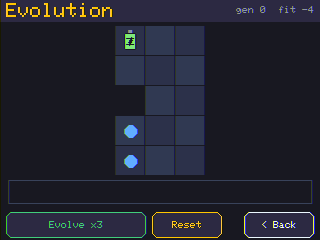 |
|:--|
| **Evolution.** A herd of random brains; the ones that get furthest **breed**. Watch the best one's path improve and the fitness curve climb, generation by generation — selection and inheritance you can actually see. |

| 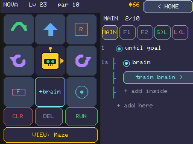 |
|:--|
| **A brain is a block in your program.** Drop a **`brain`** into the normal editor next to your loops and `if`s — *neurosymbolic* programming: explicit code for the easy parts, a trained brain for the tricky bit. It drops in **already wrapped in `repeat until at goal { brain }`** (a lone brain makes only *one* move), with a **`train brain >`** line right underneath. |

| 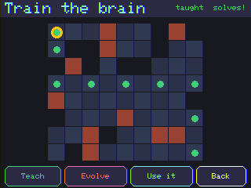 |
|:--|
| **The neuro interface — with transfer learning.** Open it from the **`train brain >`** line. **Teach** it (distil the optimal solver by backprop — reliable) or **Evolve** it, watch its path solve the maze, then **Use it**. Pick a **base** to fine-tune from — start fresh or **load a saved brain** and build on what it already knows — and **save a copy as an incremented version** (`Brain v1 → v2 → …`), so you can grow a *lineage*. The trained brain saves *with* your program, so it persists and **trades & battles over the radio**. |

| 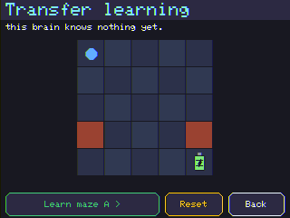 |
|:--|
| **Transfer learning, as its own lesson.** Train a brain on maze A, then **carry it over to a new maze B** — it starts far ahead of a random brain and only needs a little fine-tuning. The same trick the editor's **base** picker uses, and why a maze brain can graduate into an Arena fighter. |

| 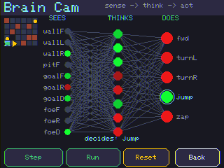 |
|:--|
| **Brain Cam — watch a trained brain *think*.** Step a distilled brain through a maze and see it live: which of the **10 inputs** light up (**SEES**), the **hidden layer** firing (**THINKS**), and the **5 outputs** with the winner ringed (**DOES**) — plus a *"decides: turnR"* verdict. The clearest answer to "what is the network actually doing?" |

| 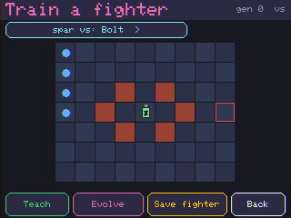 |
|:--|
| **Train a fighter for the Arena.** A **"Train a fighter"** mode off the Computer branch of the Arena menu: **Evolve** or **Teach** a brain to **win real arena matches** (fitness = *winning*, not just reaching the goal). A **"spar vs"** chip cycles your sparring partner through the whole roster — house bots **and** your library, including bots **traded over the radio** — so you can train against code *or* neuro opponents. **Save** it and it joins your Arena roster, ready to battle a friend. |

**The ML ideas a kid actually meets here** — not as jargon, but as things you *do* and *watch*: a single neuron and **gradient-descent backprop**; **multi-class** outputs (argmax picks the action); why a **hidden layer** is needed (it cracks **XOR**, which one neuron provably can't); **reinforcement learning** (tabular Q, reward shaping, explore-vs-exploit); **neuroevolution** (fitness, selection, breeding); **imitation learning / distillation** (copy an expert solver); **transfer learning & fine-tuning** (reuse a brain on a new task); a **shared feature representation** (one `10 → 8 → 5` network for two jobs); and **generalization** (a brain trained on one maze that flails on another is *over-fit* — the live step counter makes it visible as the run marches to the cap). Natural next topics the same engine could host: regularization, batching, and a tiny recurrent/memory cell.

---

## Under the hood — *the engineering that makes it work*

- **Always-solvable procedural mazes.** Every level is generated from `hash(player, level)`
  — never stored — by carving a guaranteed solution path, decorating with walls/pits at
  difficulty-scaled density, and BFS-verifying. Thousands of seeds tested; never an
  unsolvable board. Jump levels add single-tile pit gaps that *need* a jump.
- **A real interpreter.** Programs are an AST (commands, `repeat n`, `repeat-until`, `if`,
  `call F1/F2`, and a `brain` node). Execution uses an **explicit call stack**, not C++
  recursion, so it's steppable (animate one command at a time, or single-step to debug) and
  memory-bounded. A step cap stops runaway sense-loops with a friendly message.
- **One editor everywhere.** The control pad + nested program list is a single reusable
  component (`ProgramEditor`) — so the campaign, **Puzzle Race**, and the **CodeLab**
  lesson views all show the *same* blocks, glyphs, and nesting. You learn one editor.
- **One AST everywhere.** Player programs, saved library scripts, and AI opponents are the
  *same* shape — so the bot you build in the campaign drops straight into the arena. A
  **trained brain is just another node** (`N_NEURO`) in that AST, and the arena reads each
  bot's *effective* move each tick, so a brain's `zap` shoves a rival exactly like the
  hunter bot's does.
- **On-device machine learning (NeuroBot).** A from-scratch **MLP with hand-rolled backprop**,
  **tabular Q-learning**, **neuroevolution**, and **distillation** — all in fixed memory (no
  heap, no TensorFlow). A trained brain runs as a `brain` node that *senses → picks an action
  → moves*, so it's **neurosymbolic**: explicit code plus a learned policy, stepped by the
  same interpreter. Brains train on-device fast enough to *watch*, serialize **with** the
  program, and so persist, trade, and battle like any other bot.
- **Tiny art, big personality.** Robots and batteries are vector-drawn (a few hundred bytes
  of code, scalable to any tile size), plus optional 16×16 custom sprites — no SD card, no
  PROGMEM bitmap dump.
- **Made for fingers on glass.** ≥40px touch targets, debounced taps, press beeps, a chiptune
  menu theme + win fanfare + badge chime, and an RGB LED that flashes green on a win and red
  on a fail.
- **Robust persistence.** Profiles, stats, badges, the resume slot, the solution library,
  and custom sprites are JSON on LittleFS, rebuilt-index-on-write so an interrupted save
  can't brick the menu.
- **A headless dev loop.** A USB-serial screenshot + tap-injection harness
  (`scripts/shot.py`, `scripts/drive.py`) lets the whole UI be driven and photographed
  without a finger — every screenshot in this README was captured that way.

---

## Get one running — *flash it in two minutes*

GridBot runs on the **CYD (Cheap Yellow Display, ESP32-2432S028R)** — a ~$10–15
touchscreen ([grab one on Amazon](https://a.co/d/05H98aWQ)). The fastest path is the
[**browser flasher**](https://jamesdavid.github.io/cyd-GridBot/) — plug in, click, done.
From source:

```bash
git clone <this repo> && cd cyd-GridBot
# PlatformIO (see HARDWARE_SETUP.md for the venv path on Windows)
platformio run -e cyd_gridbot -t upload --upload-port <your port>
```

Full build instructions, the parts list, the toolchain setup, and the board's hard-won
quirks (display orientation, brick-wall colours, touch calibration, the no-PSRAM budget)
live in **[HARDWARE_SETUP.md](HARDWARE_SETUP.md)** so this page stays a showcase.

It is **fully offline** — no WiFi, no accounts, no data leaves the device.

---

## Technical challenges — *overcome & still open*

**Overcome**
- **Always-solvable generation** on a deterministic seed (carve-path → decorate → BFS
  verify → reroll), with fairness rules (the robot never spawns facing a wall; pit gaps
  only appear once Jump is unlocked).
- **Steppable interpreter without recursion** — an explicit frame stack drives loops,
  conditionals, and functions, animatable one primitive at a time.
- **One shared editor, three hosts** — extracting the campaign's control pad + nested list
  into a reusable component so Puzzle Race and the lessons render identical blocks without
  a second code path.
- **A from-scratch UI on a no-PSRAM ESP32** — no full framebuffer; dirty-rect tile
  rendering and a one-tile sprite keep RAM use tiny (firmware uses ~33% of RAM, ~34% flash).
- **The CYD display quirks** — landscape-native orientation, the dual-USB R/B colour order,
  and point-reflected touch calibration at rotation 6 (see `CYD-ESP32-2432S028R.md`).
- **A deterministic multi-bot arena** — same inputs → byte-identical match log, proven by
  test, which hands you fair rematches and replays for free.
- **Neural nets on a no-PSRAM ESP32** — a tiny MLP + backprop, Q-learning, evolution, and
  distillation in a few KB, with a learned brain embedded as an interpreter node
  (neurosymbolic) and trained on-device fast enough to animate. **67 host tests** cover the lot.

**Still open / known limits**
- ESP-NOW radio battle/trade is built but **hardware-pending** — it needs two physical
  boards to verify end-to-end.
- Arena AI bots are deliberately simple personalities; decisive Races rely on *different*
  bots and a hazard-strewn board (symmetric identical bots correctly draw).
- The on-screen mini-map and fog levels are reserved but not built.
- Internal cleanup: the campaign editor still carries its own copy of the editor code
  rather than delegating to the shared `ProgramEditor` (tracked in the backlog).

---

## What's next — *the road ahead*

**Recently shipped:** ✅ **NeuroBot** — a whole ML-teaching mode (backprop / Q-learning /
evolution / **transfer-learning** lessons, the **"Meet your brain"** anatomy tour, **Brain
Cam**, a trainable **brain block** with **versioned saves**, brains that persist & battle,
an **Arena trainer** that spars against any roster bot, and NeuroBot badges) ·
✅ **CodeLab** guided lessons for every block, rendered in the real editor style ·
✅ **Puzzle Race** rebuilt on the **real block editor** (program, don't drive) ·
✅ **opponent-first Arena menu** and a unified **`zap`** Sumo attack ·
✅ **coin & gem collectibles + a sprite-colour & emoji shop** · ✅ a **chiptune theme** +
win celebration (confetti & star fly-in) · ✅ five **level biomes** · ✅ a 16-badge
**achievements gallery** · ✅ **jump-arc animation** + a live **step counter** ·
✅ a one-click **online flasher**.

Still on deck (full list in **[BACKLOG.md](BACKLOG.md)**):

- More **mode types** — relay, co-op (two bots must both reach goals), king-of-the-hill —
  building on the Puzzle Race / Race / Sumo set.
- **Daily shared-seed challenges** and a leaderboard; library-bot **tournaments**.
- **Verify the radio link** end-to-end on two boards (battle + Pokémon-style trade are
  built but hardware-pending), and an optional **mini-map** in the Code view.
- **Drag-to-reorder** program lines + an **Undo**; a richer **library picker** (name on
  save, choose-which on load).

---

## Status & license

Working firmware, verified on a real CYD (the campaign, all unlock tiers, arena, lessons,
NeuroBot training, pixel editor, and achievements all run on hardware). Built phase-by-phase
from `SPEC.md` following `IMPLEMENTATION_STEPS.md`; **67 host unit tests** plus an on-device
self-test gate every change.

**License: [PolyForm Noncommercial 1.0.0](LICENSE).** Free for personal, hobby, research,
and educational use — clone it, build it, modify it, share it. **Commercial use or
reselling this (or derivatives) needs a written license.** Third-party components keep
their own licenses: **LovyanGFX**, **ArduinoJson**, and the Arduino-ESP32 core.

Built with [Claude Code](https://claude.com/claude-code).
