# GridBot — The Complete Course

### *Everything you need to take a kid from zero to a soccer-player bot they trained themselves — in one document.*

This is the **all-in-one** version of the GridBot teaching materials. It folds the three companion
docs — the [5-Day Curriculum](CURRICULUM.md) (the plan), the [Handbook](HANDBOOK.md) (the why), and
the [Hand-Coding Guide](HAND-CODING-GUIDE.md) (the how) — into a **single, self-contained guide you can
teach straight from**. You should not need to open another file: every program, question, screenshot
pointer, checkpoint, and bit of background a grown-up needs is right here, in the order you'll use it.

- **Audience:** kids ~7–13, one per **$10 CYD** touchscreen (or pairs sharing one). A grown-up
  (parent or teacher) alongside — **no coding or AI experience required.**
- **Time:** **5 sessions of 1–2 hours** (≈ 7–10 hours). Self-paced; a session can split across days.
- **Setup:** none. It's all on the device — no internet, no accounts, nothing leaves the room. Two
  devices in the same room unlock the optional multiplayer activities (never required).
- **The destination:** a robot the kid **trained themselves** to play soccer — *and* the judgement to
  know **when to write the rules and when to let the robot learn them.** That judgement is the real
  prize; the soccer bot is how they earn it.

> **How to read this.** Each **Day** is a complete, runnable lesson block: *Objective → What you need
> to know → Do this on the device → The programs → Questions to ask → Exercises → Checkpoint.* Grey
> **For the classroom** notes add objectives, timing, and standards for teachers. The front matter
> (§A–C) sets up the whole arc; the back matter (§D–H) is reference you can dip into any time.
>
> The shorter [CURRICULUM.md](CURRICULUM.md) is the one-page version of this same plan — print it as a
> wall chart; teach from *this*.

---

# Part 1 — Before you start

## §A. The one big idea

Everything in GridBot teaches **one** distinction, from two angles:

| | **CodeLab** — *write the rules* | **NeuroLab** — *train the rules* |
|---|---|---|
| The deal | **you** write the rules (drag-and-drop blocks) | **you** train the rules from examples/reward |
| Looks like | blocks: `forward`, `repeat`, `if` | a little network that learns and changes |
| Great when | the problem has a **clear rule** | the problem is **"I know it when I see it"** |
| The punchline | you can **read** exactly what it does | nobody hand-wrote it — it **learned** |

Putting these side by side lets a kid *feel* the trade-off at the heart of modern AI: **write what's
easy to write, train what's hard to write — and combine them.** (That combination is *neurosymbolic
AI*, and it's literally how a self-driving car is built: hand-written rules for the clear stuff,
learned neural nets for the judgement calls.) The whole course is an argument for that one sentence,
and by Day 5 the kid will have *lived* it: they'll hand-code three bots, find that two of them beat the
AI and one of them can't, and learn to train the one that can't.

### The throughline: "How does a self-driving car work?"

If you want one spine for the week, use this. A simplified self-driving stack has these stages, and the
course touches most of them — a handy "what does this connect to in the real world":

| Self-driving stage | What it means | Where it shows up here |
|---|---|---|
| **See** (perception) | turn camera pixels into "wall / car / lane" | Day 4 (Perception lesson) |
| **Sense from the car's view** | everything is relative to *me* (ahead/left) | Day 2 & 4 (the robot's senses) |
| **Map & route** | where am I, which way to the goal | Day 4–5 (Pilot / planner) |
| **Drive** (control) | steer, moment to moment | Day 4 (the trained brain) |
| **Remember** | hold what just went out of view | Day 4–5 (Memory / RNN) |
| **Learn from drivers** | copy experts; fix mistakes; retrain | Day 4 (Teach / Data & labels) |
| **Mix rules + learning** | rules for easy parts, a net for the rest | Day 3→4 hinge (neurosymbolic) |

## §B. How powers unlock (the campaign is the spine)

The kid doesn't get every block at once. Powers unlock as they climb campaign levels, on a curve tuned
so the big payoff — **sensing** — arrives fast. Each session plays a few levels to *earn* the day's new
power, then uses it. Pace is ~5–6 levels per session; a kid who's flying can race ahead, a stuck kid
can slow down, and the **2-/3-star** scoring rewards coming back with a cleaner program.

| Level | Unlocks | Concept | Course day |
|---|---|---|---|
| 1 | Forward (guaranteed-win intro) | sequence | **Day 1** |
| 2–5 | Turn | sequencing | **Day 1** |
| **6** | **Jump** (intro level first) | a special case | **Day 1** |
| **10** | **Repeat** (loops) | iteration / efficiency | **Day 2** |
| **15** | **Sense** (`if` / `until`) **+ the Arena opens** | conditionals, reacting | **Day 2** |
| **20** | **Functions** | abstraction, naming | **Day 2** |
| **28** | **NeuroBot** (`+brain`) **+ Teach** | machine learning | **Day 4** |
| 31 | Draw & tag (label a path) | supervised data | Day 4–5 |
| 34 | Evolve (neuroevolution) | learning w/o a teacher | Day 4–5 |
| 37 | Pilot (planner + follower) | search + control | Day 5 |
| 40 | Memory brain (RNN) | sequence memory | Day 5 |

> **Falling behind on levels?** The **lessons** (CodeLab / NeuroLab, under **Learn**) teach the
> *concepts* independently of the campaign grind, and they're open from day one. Run the lesson even if
> a kid hasn't unlocked that level yet — then let the campaign reinforce it. You never have to wait.

## §C. The week at a glance

| Day | Theme | New power | They can… | The big idea |
|---|---|---|---|---|
| **1** | 🚗 **Drive** | move / turn / **jump** | steer the robot through a maze by hand | a **program is a sequence** |
| **2** | 🧠 **Think** | **loops** + **sensing** (`if`/`until`) | write **one** program that solves *unseen* mazes | a **rule generalises** (an *algorithm*) |
| **3** | ⚔️ **Compete** | **functions** + the **Arena** | hand-code a **battle** bot and a **soccer** bot | clear rules win — *until they don't* |
| **4** | 🤖 **Learn** | **NeuroBot** (Teach / Q-Learn / Evolve) | **train** a brain instead of writing rules | when a job is feel, not rules, **let it practise** |
| **5** | 🏆 **Champion** | the trainer's knobs + the **Room** | train a soccer **striker** and run a **tournament** | iterate, measure, and *match the method* |

**Quick start (5 minutes, once):** ① Flash the device from the web flasher
(`https://jamesdavid.github.io/cyd-GridBot/`) in Chrome/Edge — plug in by USB, click install. ② On the
device tap **New Player**, name it, pick a colour (profiles are local; max 6 per device). ③ Lessons
live at **Home → Learn**; the game at **Home → Play**. That's the whole setup.

---

# Part 2 — The five days

## Day 1 — 🚗 Drive: *make it move*

**Objective:** the robot obeys a list of steps *you* write, and the kid solves a maze by hand.

> **What you need to know.** A program is a **sequence**: steps run top-to-bottom, in order. That's the
> entire idea today. The single most common bug — and the best lesson — is that **order matters**:
> `forward` then `turn` lands somewhere completely different from `turn` then `forward`. You don't need
> anything else to teach Day 1.

**Do this on the device:**
1. **Pick a player** (avatar + name) — this saves their progress.
2. **Learn → CodeLab → "1 · Move".** Tap **Run**; watch forward / turn / forward reach the goal.
3. **Play → campaign levels 1–9.** Drag command blocks, tap **Run**, *read the failure*, fix **one**
   block, re-run. **Jump unlocks at Level 6** (it gets its own guaranteed-win intro level) — use it to
   clear a pit.
4. **Star chase:** beat a level, then beat it again with **fewer blocks** for 3 stars.

**The actions they have today** (one runs per step): `forward`, `turn left`, `turn right`, and from
Lv 6 `jump` (hops 2 tiles, clears a pit).

**Questions to ask:**
- "What happens if two steps swap places?" *(forward-then-turn ≠ turn-then-forward — **order matters**.)*
- "What if you `jump` when there's no pit? What if you forget to jump at one?" *(a command is for a
  situation; using it at the wrong time is a bug.)*

**Checkpoint:** the kid can plan a turn-by-turn path and **debug a wrong turn** by changing one block
and re-running. That read → change one thing → test loop is the habit the whole course is built on.

> **For the classroom.** *Objective:* express an algorithm as an ordered sequence; debug by isolating
> one change. *Time:* 60–90 min. *Standards:* CSTA 1A-AP-10 / 1B-AP-10 (sequence). *Unplugged:* "robot
> and programmer" — one kid gives only forward/turn/jump commands, the other walks them across the room
> floor; a wrong turn shows order matters with their feet.

---

## Day 2 — 🧠 Think: *make it solve mazes it's never seen*

**Objective:** the leap from *memorising steps* to *a rule that adapts* — the conceptual heart of the
whole course. **Don't rush this day.**

> **What you need to know.** Two new blocks do all the work. A **loop** (`repeat`) does the same steps
> again and again so you don't copy-paste them. **Sensing** (`if` / `until`) lets the robot **react to
> what it sees** instead of following a fixed list. Put them together and you get an **algorithm** — a
> short rule that works on mazes it has *never seen*. That jump, from "a memorised list of moves" to "a
> general rule," is the single most important idea in the course.

**Do this on the device:**
1. **CodeLab → "3 · Repeat"** (loops unlock at **Lv 10**): replace five `forward`s with one loop. Ask
   *why a loop beats copy-paste* — it's **efficiency *and* readability**, not just less typing.
2. **CodeLab → "4 · Sense"** (`if` / `until` unlock at **Lv 15**, which also **opens the Arena**): the
   robot now reacts. Tap the keyword chip to toggle **`if`** (react once) vs **`until`** (keep going
   until true). Build the **wall-follower**:

   ```
   repeat until goal {
       if wall { turn left }
       forward
   }
   ```

   *"If there's a wall in front, turn the same way; otherwise step forward."* Because you always turn
   the *same* way, the robot traces along a wall and sweeps the maze until it reaches the goal.
   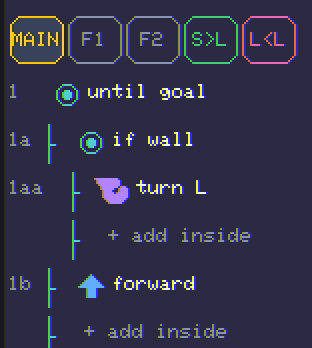

3. **The "aha":** run that *exact same* program on **three different mazes** without changing a block.
   It solves all three. *Why?* Because it's a **rule**, not a memorised path.
4. **Handle pits** — add one rule and it becomes a complete, general maze robot in **3 rules**:

   ```
   repeat until goal {
       if wall { turn left }
       if pit  { jump }
       forward
   }
   ```

   The program is now taller than the code pane — **scroll** it with the scrollbar on the right edge:
   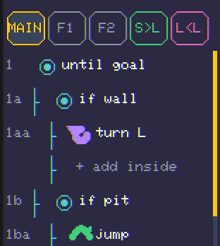 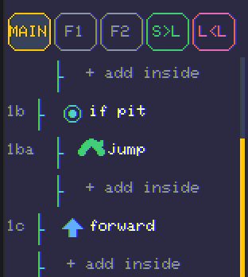
5. **CodeLab → "5 · Functions"** (Lv 20): name a group of steps and reuse it — the program gets shorter
   *and* clearer (that's **abstraction**).

**Why this is the magic lesson — with the receipts.** We gave the exact 3-rule program **16 mazes it
had never seen**:

| Robot | Solved (unseen mazes) |
|---|---|
| Wall-follower **+ jump** (hand-coded, 3 rules) | **8 / 16** |
| Plain wall-follower (no pit rule) | 5 / 16 (falls in pits) |
| A **brain trained on one maze** | **1 / 16** |

The hand-coded **rule generalises** — it solves mazes it has never seen, because the *idea* is correct.
A brain that practised **one** maze just **memorised** it and gets lost everywhere else. *(The fix for
the brain — train it on **lots** of mazes — is the real ML lesson, and it lands on Day 4.)*

**Questions to ask:**
- "This program, unchanged — could it solve a maze you've never opened? **Why?**"
- "Why did adding `jump` help? And why does the trained brain fail a new maze when it aced its own?"
  *(That's the whole difference between **a rule** and **memorising**.)*

**Checkpoint:** the kid can **explain *why* the wall-follower generalises.** This is the curriculum's
hinge — if they get this, the rest of the course clicks.

> **For the classroom.** *Objective:* distinguish a fixed sequence from a general algorithm; explain
> generalisation. *Time:* 90–120 min. *Standards:* CSTA 1B-AP-10 / 2-AP-10 (control structures);
> 2-AP-14 (modularity, for functions). *Unplugged:* blindfold-and-wall — a student keeps one hand on a
> classroom wall and walks; they always reach the door. They *are* the wall-follower.

---

## Day 3 — ⚔️ Compete: *hand-code a fighter and a striker*

**Objective:** use sensing to build **Arena** bots by hand — and *feel* where hand-coding starts to
strain. Today sets up the entire reason for Day 4.

> **What you need to know.** The Arena (unlocked Lv 15) has three games. Today uses **Battle (Sumo)** —
> shove the rival out — and **Soccer** — push the ball into the net. A good Arena bot is a **priority
> list** of `if` rules: the editor checks them **top-to-bottom** and does the first one that's true, so
> **order = priority.** New senses appear for these games (see the table below). The honest goal of the
> day is *not* a perfect soccer bot — it's the **discovery that some jobs are easy to write as rules and
> some aren't.**

**The senses you can test** (in an `if` or `repeat until`; join two with `&` = and, `|` = or):

| What | Blocks | Works in |
|---|---|---|
| Walls / pit | `wall`, `wall <`, `wall >`, `wall/pit`, `pit` | all |
| Goal | `goal` (am I on it?) | Maze |
| Foe / rival | `foe ^`, `foe near`, `foe <`, `foe >` | Battle **and Soccer** |
| Ball | `ball ^`, `ball <`, `ball >`, `ball near` | Soccer |
| Net (the goal you shoot at) | `net <`, `net >` | Soccer |

Note the gap that makes the three games feel so different: the Maze has **no** "goal is that way"
sense — only `goal` (are you standing on it). That one missing sense is a big part of why a maze is so
much easier to hand-code than soccer.

### 3.1 Battle (Sumo) — *the hunter* (hand-coding still wins)

Build a **priority list** — most important rule first:

```
repeat until goal {
    if foe ^ { zap }          ← rival right in front? ZAP it
    if pit  { turn right }    ← never charge into a pit
    if foe > { turn right }   ← rival off to my right? turn to face it
    if foe < { turn left }    ← rival off to my left? turn to face it
    if wall { turn right }    ← don't jam into a wall
    forward                   ← otherwise, charge in
}
```

Read it as a sentence: *"Zap if you can; never fall into a pit; turn toward the foe; don't get
stuck on a wall; otherwise close the distance."* It **hunts.** Six rules, so the code pane scrolls:
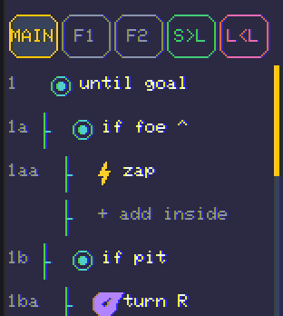 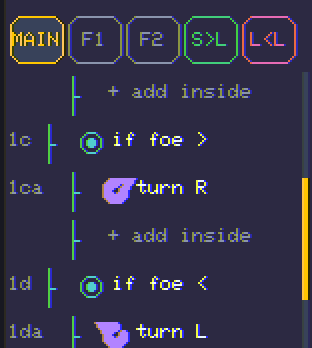 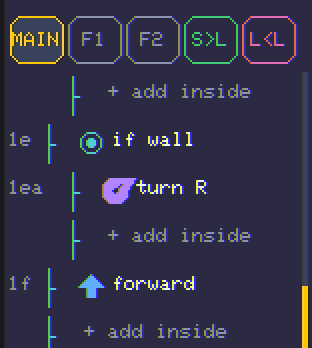

**How it does** — vs trained neural fighters over 16 matches:

| Opponent | Hunter's record (W-D-L) |
|---|---|
| A **distilled** neural fighter (copied an expert) | **9 - 5 - 2** |
| A **Teach→Evolve** neural fighter (strongest recipe) | **9 - 5 - 2** |

**The hand-coded hunter *wins*.** Battle rewards a clear, correct rule — and the trained bots are only
*imitating* a hunter like this one, so the original stays a step ahead.

> **Order is the whole lesson.** Have the kid move `forward` to the **top** and watch the bot turn dumb
> (it charges before it aims). Put it back. *Why* did the order change the whole bot?

### 3.2 Soccer — *the dribbler* (where AI starts to win)

Pushing a ball is tricky: you have to get **behind** it (the far side from the net) so a shove sends it
*toward* goal, not into your own net. The naïve chaser —

```
repeat until goal {
    if ball < { turn left }
    if ball > { turn right }
    forward
}
```

— scores sometimes, but shoves the ball **whatever way it's facing**, including into its *own* goal;
against a real opponent it **loses every time.** The fix uses the **net** sense to circle behind first:

```
repeat until goal {
    if ball ^ {                 ← I'm touching the ball
        if net < { turn right } ← net is to my left → wrong side, orbit around
        if net > { turn left }
    }
    if ball < { turn left }     ← otherwise chase the ball
    if ball > { turn right }
    forward
}
```

Note the **nested `if`** — the net checks live *inside* the `if ball ^` block. In the editor, tap
**`+ add inside`** on the `if ball ^` row to indent blocks under it.
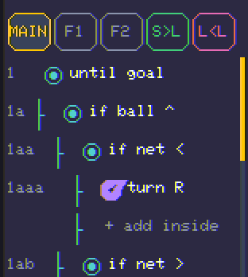 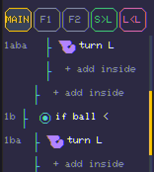

> **⚽ Pro move — the `zap`-swap.** Caught on the *wrong* side of the ball (it's between you and the net
> you're attacking)? Circling around is slow and is how bots accidentally shove it into their *own* net.
> Instead, **face the ball and `zap`** — your robot and the ball **swap places**, popping the ball one
> tile *past* you toward goal and leaving you neatly behind it. So `if ball ^ { zap }` is a one-block
> way to "turn the ball around." Each bot's facing arrow is tinted to **match the net it attacks**
> (green / red), so own-goals are easy to spot.

**How it does** — each row is **16 matches** vs a different trained striker (goals = total over 16):

| Trained-striker opponent | "Get behind the ball" |
|---|---|
| Distilled striker **A** | **draw** — 208–208 |
| Distilled striker **B** *(same recipe, different practice)* | **loses** — 128–320 |
| **Teach → Evolve** striker | **wins** — 288–208 (16–0) |
| **Max-trained** striker *(strongest possible)* | **loses** — 80–352 |

The honest read: a well-designed hand-coded soccer bot is **right at the edge of competitive** — it can
**tie** one trained striker and even **beat** the evolved one, but it **loses to others**, and the
strongest brain wins **clearly** (80–352). It is **not** the robust win the maze and battle bots are.
We tried *eight* hand-coded strategies; the ceiling for simple reactive rules is "can hang on a good
day, but a notch below the best." **Why?** A trained brain saw thousands of examples and learned
*finishing finesse* — aiming at the open corner, standing in the exact spot. Reactive blocks can't hold
a plan in memory (there are no variables), so they can't quite match it.

**Questions to ask:**
- "Why is 'follow the wall' easy to write as a rule, but 'dribble past a defender and pick your corner'
  is not?"
- "Your hand-coded soccer bot ties the trained one but can't beat the best. Is that failing — or is it
  telling you something about the *kind* of job soccer is?"

**Checkpoint:** a **working hand-coded soccer bot** *and* the realisation that it isn't enough — which
is exactly what **earns Day 4.** Soccer is the game where *learning* pays off most, so this is the
perfect moment to open NeuroLab.

> **For the classroom.** *Objective:* express strategy as prioritised conditionals; identify a problem
> where rules under-perform. *Time:* 90–120 min. *Standards:* CSTA 2-AP-10 (control), 2-AP-14
> (functions, if used). *Multiplayer tie-in:* two identical bots **draw** — so the way to *win* a
> classroom match is to make yours a little smarter (see the Day-3 exercises). *Reproduce any number*
> with `tools/bot_eval.cpp`.

### 3.3 Day-3 exercises — *level up your bot (and break the tie)*

GridBot's Arena is perfectly fair, so two **identical** bots always **draw**. Winning a classroom match
means making **yours** smarter. Each tweak below can break the tie — try it, save it, challenge a friend.

- **🧩 Maze:** swap `turn left` → `turn right` (does it still solve? race left- vs right-follower);
  spend fewer moves (turn around some pits instead of always jumping) for a better star score.
- **🤖 Battle:** add `if foe near { zap }` (hit a close foe, not only dead-ahead); pull out the
  `if pit { turn right }` line and fight near a pit to see exactly what that one rule was doing.
- **⚽ Soccer:** find **one** change that beats a mirror-image bot. *(Fair warning: an extra `forward`
  to "commit the shot" and a `foe`-based "aim away from the keeper" rule both made it **worse** in our
  tests — this is a real, open puzzle. Beat it and you've out-coded the grown-ups.)*

---

## Day 4 — 🤖 Learn: *stop writing the rules, start training them*

**Objective:** reach **NeuroBot** and train a brain from **examples** and **reward** — then beat
yesterday's hand-coded bot with it.

> **What you need to know.** A NeuroBot brain is a tiny neural network: **10 senses → 8 hidden → 5
> actions**, the *same shape* for mazes, battle, and soccer — only what it senses as the goal and how
> it's rewarded changes. You don't program it; you **train** it three ways: **Teach** (copy an expert —
> *imitation learning*), **Q-Learn** (reward what works — *reinforcement learning*), **Evolve** (the
> best brains breed and mutate — *neuroevolution*). Training nudges the brain's numbers (*weights*) to
> lower its mistakes (*loss*). The senses here are **handed** to the brain as clean numbers; a real
> robot would need a camera to work them out — *that's perception, the hard part real robots spend most
> effort on.*

**Do this on the device:**
1. **NeuroLab lessons** (Learn → NeuroLab) — small enough to *watch* the mechanism. Run at least these
   four:
   - **One neuron** — it guesses, sees the error, nudges its weights; the loss bar shrinks to "learned!"
     Nobody told it the rule — it figured it out from examples. 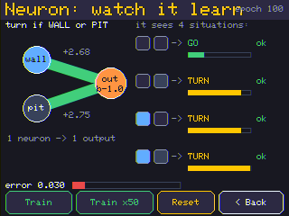
   - **Perception** — where the senses come from (the tiles next to the robot becoming the input
     numbers), and the honest catch that a real robot needs a camera to produce them.
   - **Many actions** — the brain has several outputs and **picks the strongest** (*argmax*).
   - **The Right Tool** — *match the method to the problem* (the capstone idea, previewed).
2. **Arena → Train a fighter → Soccer.** Try all three engines and watch the live **learning-curve**
   sparkline: **Teach** (sharp in seconds — it's imitating an expert dribbler), **Q-Learn** (no teacher,
   just "did it score?"), **Evolve** (a population breeding the best). 
3. **Code vs brain:** field a **trained** soccer brain against **yesterday's hand-coded** one. Watch the
   brain do the finishing finesse your blocks couldn't.

**The full menu of NeuroLab lessons** (all open from day one — dip in as curiosity strikes): One neuron
· Backprop step-by-step · Perception · Hidden layer (the XOR "one neuron can't") · Many actions · Robot
brain (the 10→8→5 tour) · Data & labels · Q-learning · Tuning the grid · Tuning a real net · Evolution ·
Transfer · Brain Cam (watch a live brain think) · Pilot · Memory (RNN) · Self-play · The Right Tool.
Each is a 5–15-minute watch-and-poke; you do **not** need all of them for the course — the four in
step 1 plus the trainer in step 2 are the spine.

### Know your three trainers (this is the meat of NeuroLab)

The Arena trainer (**Arena → Train a fighter**) gives you three ways to shape the *same* `10→8→5`
brain. They are **not** interchangeable — each is strong somewhere and weak somewhere, and most of Day 5
is about combining them well. Teach this table before anyone touches a knob:

| Trainer | What it does | Strong because… | Weak because… |
|---|---|---|---|
| **Teach** *(imitation / distillation)* | backprop the brain to **copy a scripted expert** (a perfect dribbler / hunter) | **sharp in seconds** — competent almost immediately | capped at the expert; it *imitates*, it doesn't out-think a specific opponent |
| **Evolve** *(neuroevolution)* | a **population** of brains plays; the best **breed + mutate**; repeat — no teacher | can discover moves no expert was scripted for; **adapts to a specific opponent** | **slow from scratch**, and on a *fixed* board it happily **overfits** |
| **Q-Learn** *(reinforcement)* | one brain tries over and over; a **reward** (a goal) reinforces good moves | no teacher and no labels — just *"did it score?"* | **noisy**; needs many episodes; a bad reward can *mislead* it |

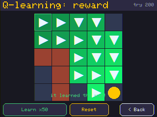 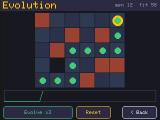

> **The one rule that makes them combine: transfer learning is the default.** In GridBot's trainer,
> **Teach, Evolve, and Q-Learn all build on the brain you already have** — they never silently throw it
> away. So the natural recipe is **Teach first to get competent, then Evolve or Q-Learn to sharpen.**
> The *only* way to wipe a brain back to random noise is the explicit **"Fresh"** (scramble) button.
> *(That single design choice — seed from the current brain, not from noise — is what makes "Teach →
> anything" actually build on the Teach. It matters more than it sounds; see Day 5.)*

### Lab 4 — train your first fighter (≈ 20 min)

1. **Arena → Train a fighter → Soccer.** Tap **Teach** and watch the **learning-curve** sparkline jump:
   in a couple of seconds you have a brain that dribbles. 
2. **Spar it up the ladder** — **Bolt → Coil → Spin → Vex → Ace** — and watch where it starts to win.
3. **Save** it as your fighter (give it a name like *v1*).
4. **Code vs brain:** field this trained brain against **yesterday's hand-coded** dribbler. The brain's
   finishing finesse — aiming at the open corner, standing in the exact spot — is the thing your blocks
   couldn't write down. **That gap is the whole reason machine learning exists.**

> **A result worth showing (measured on real devices):** a **Teach**-distilled striker reached a
> *one-goal* game against a strong opponent in seconds. An **Evolve-from-scratch** brain — same brain,
> same seconds, but starting from random noise — lost **1–7**. **If a good expert exists, imitate it
> first; don't evolve from nothing.** (Full head-to-head numbers are in
> [TRAINING_FINDINGS.md](TRAINING_FINDINGS.md).)

**Questions to ask:**
- "Did anyone *tell* the neuron the rule, or did it figure it out from the examples?" *(examples, not a
  rule — that distinction is the whole of machine learning.)*
- "It learned mazes, then fighting, now soccer — what stays the **same** about its brain, and what
  **changes**?" *(the network is identical, 10→8→5; only the objective and reward change.)*
- "Teach was great in seconds; Evolve-from-scratch was terrible in the same time. **Why copy an expert
  instead of discovering from zero?**" *(a head start beats a blank page when a good example exists.)*

**Checkpoint:** a **trained brain that out-plays the hand-coded bot at soccer**, *saved* to the library —
and the kid can name the three trainers and say what each is good at.

> **For the classroom.** *Objective:* explain that an ML model learns parameters from examples/reward to
> minimise error; contrast imitation vs reward vs evolution. *Time:* 90–120 min. *Standards:* AI4K12
> *Learning*; CSTA 3A-AP-15 (models). *Discussion (Societal Impact):* "If the examples were unfair,
> would the brain be unfair? Who picks the examples?" *Unplugged:* "Guess the rule" — you secretly pick
> a rule ("clap if it's a fruit"), call out items, students correct their guess each round. They *are*
> the neuron; each correction is one training step.

---

## Day 5 — 🏆 Champion: *train a striker, then a tournament*

**Objective:** refine a real soccer **striker**, then crown a champion across the class.

> **What you need to know.** Today is about **iterating with evidence.** Because the Arena is
> **deterministic** — no hidden dice — a rematch is *exact*, so any improvement you see is **real, not
> luck.** That's what makes "train → save → rematch" a genuine engineering loop instead of gambling. The
> soccer trainer is tuned to teach good habits: it **penalises pushing the ball the wrong way (toward
> your own net) 2×** and **rewards a goalward `zap`**, so the brain learns to **avoid own-goals** and
> use the **swap**.

### The championship recipe (and the trap next to it)

Everything below is from **real matches between two devices**, replayed byte-for-byte on both — so
these are findings, not opinions. They are the most useful 10 minutes of AI you can teach a kid,
because they show that *which* refinement you pick matters more than *how hard* you train.

**✅ The recipe that won — Teach → Evolve against the actual opponent.** Distill a competent striker,
then **Evolve *that* brain specifically against the bot you have to beat.** Of every combination tried,
this was the **only** one that beat the strong opponent — **5–2.** Why it compounds: evolution selects
directly for *"did you beat *that* bot?"*, so every generation pushes your already-competent brain
toward the real goal.

**⚠️ The trap right next to it — Teach → Q-Learn against a *cone*.** Take the *same* distilled striker
and Q-Learn it to "score the ball" against a **stationary** defender, and it gets **worse than Teach
alone — 0–7.** The reward was aimed at a *simpler world than the real match* (a still cone, not a moving
rival), and its pull **overwrote** the good distilled habits. **A refinement aimed at the wrong target
can destroy a good brain.**

**🔧 The fix was *realism*, not a new algorithm.** Run the **real opponent's brain as a moving
defender** during Q-Learn and the *identical* recipe went from **0–7 to 3–3** — a dead heat. *Train
against what you'll actually face.* And **let the reward stage finish**: a half-done Q-Learn (saved
~18 of 32 rounds) was the worst of both worlds — perturbed but not refined — and didn't win; the *same*
run taken to **all 32 rounds** turned a draw into a **win.** Episode count is not a footnote.

| Take the same distilled striker, then… | Result vs the strong opponent |
|---|---|
| nothing (Teach only) | competent — a one-goal game / draw |
| **Evolve** against the actual opponent | **wins 5–2** ✅ |
| Q-Learn against a *stationary cone* | **regresses to 0–7** ⚠️ |
| Q-Learn against the *real moving* opponent | recovers to **3–3** 🔧 |
| Q-Learn, but *finished* (all rounds) vs a live striker | **flips a draw into a win** |

> **Watch over-fitting happen.** Evolve a brain on **one fixed pitch** for too long (we ran 256
> generations) and in a real match it literally **"just stays there"** — it memorised that one board so
> hard it's useless anywhere else. The fix: **move the kickoff ball every generation** so it has to play
> from *anywhere*. (Generalising isn't the same as winning — the varied-board brain stopped freezing but
> was still weak until it was Teach-seeded.) This is the Day-2 maze lesson again: a memoriser fails on
> the unseen; vary the training so a *rule* forms.

**Do this on the device:**
1. **Train a striker properly:** **Teach** a dribbler first (fast, from the expert), **then refine.** The
   trainer **builds on the brain you have** (transfer learning is the default; **"Fresh"** is the only
   thing that scrambles it). Prefer **Evolve against a real saved opponent**; if you Q-Learn, do it
   against a **live** sparring partner and **let it run to the end**, not a quick stop. **Save** your
   striker. *(The soccer trainer also helps: it **penalises a wrong-way push 2×** and **rewards a goalward
   `zap`**, so the brain learns to avoid own-goals and use the swap.)* 
2. **The loser-levels-up loop:** lost a match? **Save the foe** — it copies the winner into your library
   as `«owner» «fighter»` (e.g. *AA fighter v4*) — train against **that exact bot**, and **rematch.**
   Because the Arena is **deterministic**, a rematch is *exact*: any improvement you see is **real, not
   luck.** That's what turns "train → save → rematch" into science instead of gambling.
   - *Honest caveat to share:* a single levelling-up pass isn't always enough. In our tests **Battle
     flipped** on one retrain (the skill gap was small) but **Soccer didn't** — the first competent
     striker held its ground 5–2. A bigger gap needs more than a like-for-like retrain.
3. **Knobs (optional, advanced):** open the **Knobs** panel to tune **learning rate / rounds / explore**
   and watch the loss fall smoothly, crawl, or thrash — *hyperparameter tuning*, the part of ML that's
   more cooking than math. Turn **explore to 0** and training can get stuck repeating one path; too high
   and it never settles. There's a sweet spot.
4. **Tournament — the capstone:**
   - **One device:** **vs Computer → Tournament** runs your saved fighters as a **Cup** (single-elim) or
     **Ladder** (round-robin); pick the discipline (Race / Soccer / Battle).
   - **The class:** **Arena → Radio → Room** gathers *every* nearby CYD's striker into **one shared
     bracket**. The host picks the discipline and starts it; every board replays the identical Cup from a
     shared seed and crowns the **same champion** — no central scoreboard, no internet, nothing leaves
     the room. 

> **🩺 "My bot got *worse* after I trained it!" — the troubleshooting box.** This is the most valuable
> moment of the week, not a failure. Walk through it:
> - *Did you refine against a too-easy practice partner?* (a still cone, an idle bot) → it learned a
>   simpler game than the real match. **Refine against a real, moving opponent** (Save-foes the bot you
>   must beat).
> - *Did you stop the reward run early?* → a half-finished Q-Learn is mid-regression. **Let it finish.**
> - *Did you Evolve a long time on one board?* → over-fitting. **Vary the board** (or re-Teach to reset
>   the habits, then refine).
> - *Still stuck?* The gap may be too big for one pass — Teach a fresh competent base and Evolve *that*
>   against the opponent.

**Questions to ask:**
- "Two kids both Teach a striker, then one Evolves vs the real rival and one Q-Learns vs a cone. **Why
  does the cone one get worse**, even though it 'trained more'?" *(it practised an easier game than the
  one it has to play.)*
- "Your hand-coded bot vs your trained bot — which would you bring to the tournament, and **why**?"
- "Why does a *deterministic* Arena make a rematch a fair test of whether your change actually helped?"

**Checkpoint (the finish line):** a **soccer-player bot the kid trained themselves**, refined with a
recipe they can *justify* (Teach to get competent → refine against the real opponent → run it to the
end), fielded in a real bracket — and a kid who can say **when** they'd write the rules and **when**
they'd train them.

> **For the classroom.** *Objective:* iterate a model using deterministic evaluation; explain why
> training-target alignment (and finishing the run) changes the outcome. *Time:* 90–120 min (Day 5 alone
> can fill a "science-fair" afternoon — everyone trains a striker, a Room tournament decides it).
> *Standards:* AI4K12 *Learning*; CSTA 2-AP-17 / 3A-AP-21 (testing, iterating). *Deep-dive for you:*
> the full head-to-head log is in [TRAINING_FINDINGS.md](TRAINING_FINDINGS.md). *Assessment (exit
> ticket):* "Describe one time today you changed something, measured it on a rematch, and kept or undid
> the change. What did the measurement tell you?"

---

# Part 3 — The payoff and the reference shelf

## §D. The payoff: *match the method*

The whole course on one line each — and the single most important table to revisit on Day 5:

| Game | Best hand-coded result vs a trained brain | Who wins? |
|---|---|---|
| 🧩 **Maze** | a 3-rule wall-follower solves **8×** more unseen mazes | ✍️ **Hand-coding** — a correct rule generalises |
| 🤖 **Battle** | the hunter goes **9-5-2** vs trained fighters | ✍️ **Hand-coding** — clear priorities win |
| ⚽ **Soccer** | the best dribbler **ties some** strikers, **loses to others**, strongest beats it 80–352 | 🧠 **Learning** — finesse needs practice |

**That's why machine learning exists.** When a job is easy to describe as rules (find the wall, face
the foe), *write the rules* — it's clearer, faster, and it generalises. When a job is full of feel and
judgement that's hard to put into words (dribble past a defender and pick your corner), **let the robot
practise.** A kid who hand-codes *first* never treats the brain as a black box — they know what it's
trying to do, because they tried to do it themselves. *(Every number reproducible from
`tools/bot_eval.cpp` on the real match engine.)*

## §E. Going multiplayer — the Room (optional, no internet)

Two or more CYDs in the same room trade and battle bots over short-range radio (ESP-NOW) — **nothing
leaves the room**, which is exactly why it's classroom-safe and a great teachable contrast to cloud AI.
A bot you receive joins your library — its program **and** its trained brain — as *your bot* to battle
or train against. Drop these in as **📡 Try together** moments:

- **Teacher "boss bot."** The teacher trains a NeuroBot, sends it to everyone; each student must train
  one that beats it. Instant, self-levelling challenge.
- **Starter-brain handout.** Teacher sends a half-trained brain; students **fine-tune** it to their own
  maze (the *Transfer* lesson, made social).
- **Trade & battle.** Swap brains and race / soccer / sumo them — comparing a friend's bot to yours is
  the best debugging prompt there is.
- **Class tournament (the Room).** **Arena → Radio → Room** — every device's fighter in one shared,
  seed-identical bracket. The capstone of Day 5.

*Setup:* two CYDs powered on, same room → **Arena → Radio**. No pairing codes, no Wi-Fi, nothing for IT
to approve. If a transfer stalls, move them closer and retry.

## §F. Honest simplifications (so you can answer "is this *really* how it works?")

GridBot is true in spirit and simplifies for clarity. Where it bends, say so out loud — it builds trust
and is itself good science:

- **The senses are handed over (mostly).** Outside the *Perception* lesson the brain gets clean numbers,
  not pixels. Real perception is much harder and is the bulk of real-robot effort.
- **The brains are tiny.** `10→8→5` (a few hundred numbers); real models have millions to billions. The
  *mechanism* (weights, layers, backprop, argmax) is genuine; the *scale* is not.
- **Training takes seconds, not months.** Mazes are small and the "expert" is a perfect solver, so
  learning is fast. Real training is enormous and noisy.
- **"Teach" copies a perfect solver.** That's real *imitation learning / distillation*, but real experts
  (human drivers) are imperfect and inconsistent.
- **No real physics or sensors.** A grid, not a road; no slip, weather, or sensor noise.

## §G. Standards map (CSTA · AI4K12)

| Course content | AI4K12 Big Idea | CSTA (illustrative) |
|---|---|---|
| Day 1 — Move / Jump (sequence) | — | 1A-AP-10, 1B-AP-10 |
| Day 2 — Repeat / Sense / Functions | Representation & Reasoning | 1B-AP-10, 2-AP-10, 2-AP-14 |
| Day 3 — Arena bots (prioritised conditionals) | Representation & Reasoning | 2-AP-10, 2-AP-17 |
| Day 4 — NeuroBot (Teach / Q-Learn / Evolve), Perception | Learning + Perception | 3A-AP-15; AI4K12 "ML", "perceive via sensors" |
| Day 5 — Iterate + tournament; the Right Tool | Learning | 2-AP-17, 3A-AP-21; method selection |
| *Talking about it* prompts | Societal Impact | 2-IC-20, 3A-IC-24 (impacts, bias) |

*(CSTA codes are guidance, not certification — adapt to your grade band.)*

## §H. Glossary (kid ↔ grown-up)

| Word | For a kid | For a grown-up |
|---|---|---|
| **algorithm** | steps that always work | a general procedure, not a fixed answer |
| **loop** | do it again and again | iteration / control structure |
| **condition** | "if this, then that" | branching on sensor state |
| **function** | steps you name and reuse | named reusable sub-routine (abstraction) |
| **sequence** | steps in order | ordered list of instructions |
| **neuron** | a tiny decision-maker | a weighted sum + nonlinearity |
| **weight** | how much an input matters | a learned parameter |
| **loss** | how wrong it still is | the error being minimised |
| **training** | nudging it until it's right | gradient descent on the loss |
| **backprop** | how it figures out which knob to turn | backpropagation of error gradients |
| **hidden layer** | the in-between thinking | intermediate representation (enables non-linear) |
| **argmax** | pick the strongest choice | take the highest-scoring output |
| **reward** | points for doing well | the RL objective signal |
| **hyperparameter** | a knob you set *before* training | a setting that controls learning, not learned by it |
| **explore / exploit** | try new things vs use the best so far | the ε trade-off in RL |
| **imitation (Teach)** | copy an expert's moves | supervised learning from expert labels |
| **evolution** | the best robots make robot babies | population + selection + crossover + mutation |
| **self-play** | get better by beating an old you | training vs a frozen/co-evolving copy |
| **transfer** | reuse skills on something new | fine-tuning a pre-trained model |
| **generalise** | works on stuff it never saw | performs on held-out data |
| **over-fit** | memorised, can't handle new | fits training data, fails to generalise |
| **perception** | turning what it sees into meaning | mapping raw input → features/labels |
| **deterministic** | same start → same result, every time | no randomness; reproducible |
| **neurosymbolic** | rules + a trained brain together | hybrid symbolic + learned system |

---

*One device, one week, zero internet — from "I write the rules" to "I train the rules," with a soccer
champion to show for it. Made to be taught straight from. Something didn't land? That's data — file it.*
