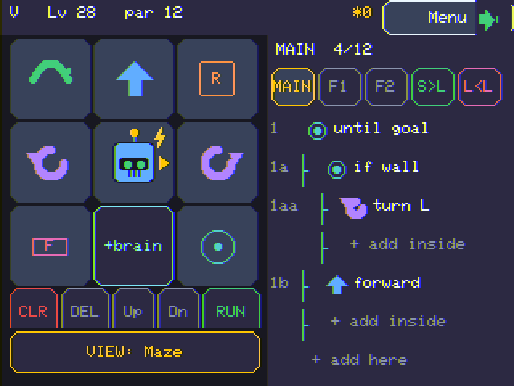
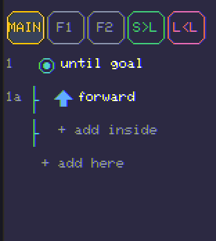
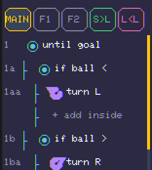
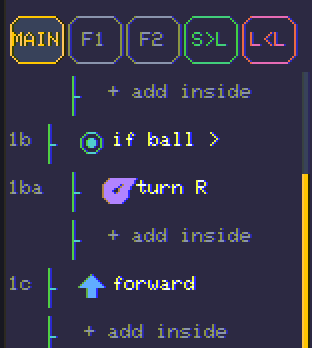

# GridBot — Hand-Coding Guide (before you switch to AI)

*For kids, parents, and teachers.* This guide shows how to **write the rules yourself** with the
block editor for all three games — **Maze**, **Battle**, and **Soccer** — so you understand what a
robot needs to think about *before* you ask the AI to learn it for you.

The big idea at the end is the best part: **some jobs are easy to hand-code and some are not** — and
that's exactly *why* machine learning exists. You'll feel it in your hands.

> **Teaching a full course?** These programs are folded — with a day-by-day plan and the AI lessons
> that follow — into **[COURSE.md, the all-in-one Complete Course](COURSE.md)** (Day 3 covers the bots
> below). Use that if you'd rather not flip between docs; use this guide for the deepest dive on the
> hand-coding itself.
>
> **Ready for the AI half?** Its sequel, the **[AI Coding Guide](AI-CODING-GUIDE.md)**, does these same
> three games with a trained **`+brain`** (Teach / Q-Learn / Evolve) — and shows, with measured results,
> exactly where *training* beats *writing the rules*.

> Everything below is a real program you can build in the editor, and every result was measured by
> playing these exact bots against trained neural bots on the device's match engine. The numbers are
> at the bottom of each section.

---

## 1. How the editor thinks

Your robot runs its program **over and over, very fast**. Each loop it looks at its **senses**, then
does **one action**. That's it. Good robots are just good rules about *"what do I see → what do I do."*

**Actions** (one per step): `forward`, `turn left`, `turn right`, `jump` (hops 2 tiles, clears a
pit), `zap` (Battle: shove a rival; **Soccer: swap places with the ball** when you're facing it —
a one-move way to get on its *far* side and turn it back toward goal).

**Senses** you can test in an `if` or `repeat until` block:

| What | Blocks | Works in |
|---|---|---|
| Walls | `wall` (ahead), `wall <`, `wall >`, `wall/pit` (either ahead) | all |
| Pit | `pit` | all |
| Goal | `goal` (am I standing on it?) | Maze |
| Foe / rival | `foe ^`, `foe near`, `foe <`, `foe >` | Battle **and Soccer** |
| Ball | `ball ^`, `ball <`, `ball >`, `ball near` | Soccer |
| Net (the goal you shoot at) | `net <`, `net >` | Soccer |

Two blocks do the looping and thinking:
- **`repeat until <sense>`** — keep doing the inside until the sense is true. We use
  `repeat until goal` for everything (in Battle/Soccer there's no goal, so it just runs the whole match).
- **`if <sense> { … }`** — do the inside only when the sense is true. You can join **two** senses
  with `&` (and) or `|` (or), e.g. `if ball < & net >`.

> **Important sensing note:** in Soccer the same `foe` blocks that find an enemy in Battle find the
> **other player**, and `net <` / `net >` point at *the goal you're attacking*. There is **no**
> "goal is that way" sense for the Maze — only `goal` (are you on it). That one missing sense is a
> big part of why the three games feel so different to hand-code.

Here's the editor: the **block palette** is on the left (tap an arrow to drop that block into your
program), and your **program** grows on the right. The screenshots in this guide show that right-hand
program pane.



---

## 2. Maze — *the wall-follower* 🧩 (hand-coding's home turf)

**Goal:** reach the battery. **The trick every maze-solver knows:** keep one hand on a wall and walk.
You will *always* find your way out — even on a maze you've never seen.

### Build this

```
repeat until goal {
    if wall { turn left }
    forward
}
```

That's the whole thing. "If there's a wall in front of me, turn; otherwise step forward." Because you
always turn the *same* way, you trace along the wall and sweep the maze until you hit the goal.

*Here it is in the real editor (tap the arrows on the left to add each block):*


> Tip: start even simpler — a program that's **just `forward`** (  )
> drives straight until it bonks a wall. Then add the `if wall { turn left }` rule and watch it start
> to *follow* the wall. Building up one rule at a time is the whole game.

### Make it handle pits (use a function or just add a line)

Real mazes have **pits**. Walking into one = you fall. Add one rule:

```
repeat until goal {
    if wall { turn left }
    if pit  { jump }
    forward
}
```

Now you **jump pits** and **turn at walls**. This is a complete, general maze robot in *3 rules*.
The program is now longer than the code pane, so **scroll** it (tap the scrollbar on the right edge):

 

### Why this is the magic lesson

We gave this exact program **16 mazes it had never seen**:

| Robot | Solved (unseen mazes) |
|---|---|
| Wall-follower **+ jump** (hand-coded, 3 rules) | **8 / 16** |
| Plain wall-follower (no pit rule) | 5 / 16 (falls in pits) |
| A **brain trained on one maze** | **1 / 16** |

The hand-coded **rule** generalises — it solves mazes it has never seen, because the *idea* is
correct. A brain that practised **one** maze just **memorised** it and gets lost everywhere else.
**This is the #1 thing to feel before doing AI:** a good rule beats a narrowly-trained brain.
*(The fix for the brain is to train it on **lots** of mazes — that's the real ML lesson in NeuroLab.)*

> Teacher note: ask *"why did adding `jump` help? why does the brain fail a new maze when it aced its
> own?"* That's the difference between **a rule** and **memorising**.

---

## 3. Battle (Sumo) — *the hunter* 🤖 (hand-coding still wins)

**Goal:** zap/shove the rival out; last bot standing wins. A great fighter is a **priority list**:
the most important rule first. The editor checks your `if`s top-to-bottom and skips the ones that
aren't true, so order = priority.

### Build this

```
repeat until goal {
    if foe ^ { zap }          ← rival right in front? ZAP it
    if pit  { turn right }    ← never charge into a pit
    if foe > { turn right }   ← rival off to my right? turn to face it
    if foe < { turn left }    ← rival off to my left? turn to face it
    if wall { turn right }    ← don't jam into a wall
    forward                   ← otherwise, charge in
}
```

Read it as a sentence: *"Zap if you can; never fall into a pit; turn toward the foe; don't get
stuck on a wall; otherwise close the distance."* It **hunts** — it always turns to face the enemy and
shoves when close.

*This one is six rules long, so the code pane scrolls — top → middle → bottom:*

  

### How it does

We played this hand-coded hunter against trained neural fighters over 16 matches:

| Opponent | Hunter's record (W-D-L) |
|---|---|
| A **distilled** neural fighter (copied an expert) | **9 - 5 - 2** |
| A **Teach→Evolve** neural fighter (the strongest trainer recipe) | **9 - 5 - 2** |

**The hand-coded hunter *wins*.** Battle rewards a clear, correct rule — and the trained bots are only
*imitating* a hunter like this one, so the original is a step ahead. Hand-coding is genuinely
competitive here.

> Teacher note: have students **reorder** the rules (put `forward` first, or `zap` last) and watch the
> bot get worse. Priority order is the whole lesson.

---

## 4. Soccer — *the dribbler* ⚽ (where AI starts to win)

**Goal:** push the ball into the **net**. This is the hard one to hand-code, and that's the point.
Pushing a ball is tricky: you have to get **behind** it (on the far side from the net) so that when
you shove, it goes *toward* goal — not into your own net.

### First try (and why it's not enough)

The obvious bot just chases the ball and pushes:

```
repeat until goal {
    if ball < { turn left }
    if ball > { turn right }
    forward
}
```

It scores sometimes… but it shoves the ball **whatever way it's facing**, including into its *own*
goal — so it gives away cheap own-goals. *(In our eval this scrappy chaser won only ~4% of games vs
trained strikers — the "get behind" bot below, which stops scoring on itself, roughly triples that to
~14%. Still a losing record, but the **idea** clearly helps.)*

 

### The good version — *get behind the ball*

The fix uses the **net** sense. When you're right on the ball, if the net is off to one side you're
on the wrong side — so **turn away** from the net to swing *around* the ball until the net lines up in
front, *then* push:

```
repeat until goal {
    if ball ^ {                 ← I'm touching the ball
        if net < { turn right } ← net is left → I'm on the wrong side, orbit around
        if net > { turn left }
    }
    if ball < { turn left }     ← otherwise chase the ball
    if ball > { turn right }
    forward
}
```

This "circle behind, then push" robot is **much** stronger. Notice the **nested `if`** — the net
checks live *inside* the `if ball ^` block (indented one step further). In the editor, tap **`+ add
inside`** on the `if ball ^` row to put blocks inside it:

 

> **⚽ Pro move — the `zap`-swap.** Heading the *wrong* way with the ball (about to shove it toward your
> *own* net)? Circling around to the other side is slow. Instead, face the ball and **`zap`** — your
> robot and the ball **swap places and you spin 180°**, so the ball lands **directly in front of you,
> pointing back the way you came**. One `forward` then drives it the *other* direction. So
> `if ball ^ { zap }` followed by `forward` is a two-block way to **turn the ball around and take it**.
> (A trained brain can learn this too — the soccer trainer rewards a zap that moves the ball goalward.)

### How it does

Measured in one multi-seed run (`tools/bot_eval.cpp` — each row aggregates 4 trained opponents × 16
kickoffs = **64 games**), as a **win-rate**:

| Hand-coded bot vs a panel of distilled strikers | Win-rate (64 games) |
|---|---|
| naive **chaser** | ~**4%** (3-5-56) |
| **"get behind the ball"** | ~**14%** (9-0-55) |

So an honest read: **every** hand-coded soccer bot we tried **loses** to trained strikers. The naive
chaser wins ~4%; getting behind the ball roughly triples that to ~14% — better, but still a clear losing
record. Against the *strongest* striker (a Teach→Evolve one) the best hand-coded bot won just **7%**
(5-0-59); against a more moderate one (distill-20k) it managed **23%**. Soccer is **not** a hand-coding
win the way the maze and battle bots are.

> **Qualify it:** one deterministic host run over fixed seeds vs **distilled strikers** (one opponent
> class) — reproducible, but not an independent-sample confidence interval. An **older version of this
> guide reported a "coin-flip" (~50%)**; that came from an eval that accidentally replayed the same
> match every seed. With the kickoff now varied per seed, the honest result is the losing record above —
> which is *itself* the lesson on why you average over real seeds.

The lesson worth telling the kids: the careful **"get behind the ball"** idea **does** beat the naive
chaser (~14% vs ~4%) — a sensible rule helps — but no rule we wrote was enough to *win* soccer. That's
the perfect moment to open NeuroLab.

**Why?** A trained brain saw thousands of examples and learned *finishing finesse* — aiming at the
open corner of the net, hitting the exact spot to stand. Reactive blocks can't hold a plan in memory
(there are no variables), so they can't quite match it. **Soccer is the game where *learning* pays
off most** — which is the perfect moment to open NeuroLab.

---

## 5. The payoff: *match the method*

Here's the whole lesson on one line each:

| Game | Best hand-coded result vs a trained brain | Who wins? |
|---|---|---|
| 🧩 **Maze** | a 3-rule wall-follower solves **8×** more unseen mazes | ✍️ **Hand-coding** — a correct rule generalises |
| 🤖 **Battle** | the hunter goes **9-5-2** vs trained fighters | ✍️ **Hand-coding** — clear priorities win |
| ⚽ **Soccer** | the best dribbler **loses** to trained strikers (~4–14% win, 64 games); a well-trained one wins ~92% (Teach→Evolve 59-5) | 🧠 **Learning** — *if trained well*; finesse needs practice |

**That's why machine learning exists.** When a job is easy to describe as rules (find the wall, face
the foe), *write the rules* — it's clearer, faster, and it generalises. When a job is full of feel and
judgement that's hard to put into words (dribble past a defender and pick your corner), **let the
robot practise** until it learns what you couldn't easily say.

### Try it yourself, in order
1. **Hand-code** the maze wall-follower. Watch it solve a maze you've never opened. *(You wrote a
   rule that works on the unknown — that's powerful.)*
2. **Hand-code** the battle hunter. Beat the computer. Reorder the rules and see it get worse.
3. **Hand-code** the soccer dribbler. Get a draw against the trained striker — then notice you can't
   quite win.
4. **Now open NeuroLab.** Use **Teach** to copy an expert, then **Evolve** or **Q-Learn** to sharpen
   it against a real opponent. Watch the soccer brain do the thing your blocks couldn't.

You'll have *earned* the AI — you know exactly what it's learning, because you tried to write it down
yourself first.

---

## 6. Exercises — *level up your bot (and break the tie)*

**Why this matters for multiplayer:** GridBot's Arena is perfectly fair, so if you and a friend field
the **identical** bot, the match is a mirror and ends in a **tie** every time. The way to *win* a
classroom match is to make **your** bot a little smarter than everyone else's. Each exercise below is
a tweak that can break the tie — try it, save it, then challenge a friend in the Arena (or the
networked **Room**).

### 🧩 Maze
1. **Right-hand rule.** Change `turn left` to `turn right`. Does it still solve the maze? Now race a
   left-follower against a right-follower on the same board — one hand is often the *much* shorter way
   out.
2. **Spend fewer moves.** Your bot jumps at every pit. Can you turn around some pits instead, and only
   `jump` when you must? Fewer steps = a better **star score** — and a faster bot wins a race.
3. **Predict before you Run.** On a brand-new maze, point to where you think it'll go *first*. If you
   were wrong, ask *why* — what did your rule actually say to do?

### 🤖 Battle
1. **Beat the basic hunter.** The plain hunter is strong — can you build one that beats *it*? Remember
   a `zap` only shoves a foe in the tile **directly ahead** — so the trick is *lining up the shot*.
   Experiment with the turn rules and their **order** to face the foe faster (a zap that fires when the
   foe is merely "near" but not dead-ahead just whiffs). Save both fighters and pit them against each other.
2. **Order is everything.** Move `forward` to the **top** of the list and watch your fighter turn dumb
   (it charges before it aims). Put it back. Explain *why* the order changed the whole bot.
3. **Pull a rule out.** Delete the `if pit { turn right }` line and fight near a pit. What goes wrong?
   That tells you exactly which job that one rule was doing.

### ⚽ Soccer
1. **Win the tie.** Two "get behind the ball" bots will draw. Find **one** change that wins — maybe an
   extra `forward` to commit the shot, or a `wall` rule so you don't get stuck. *(Fair warning: in our
   tests both of those made it **worse** — this is a real, open puzzle. Beat it and you've out-coded
   the grown-ups.)*
2. **Use the foe.** Add a `foe <` / `foe >` rule to aim away from the keeper. We couldn't make this
   help with simple blocks — can you?
3. **Know when to switch.** If your best blocks still lose to the trained striker, that's not failing —
   that's the lesson landing. Open **NeuroLab** and *train* one. You now know exactly what it's learning.

> **Classroom tournament.** Everyone hand-codes the *same* starting bot, then gets 10 minutes to "level
> it up" with one or two changes. Run a round-robin in the Arena. The **ties** show who just copied;
> the **wins** show who actually *improved* — and every win is a tiny idea the kid can explain.

---

## For parents & teachers

- **No setup, no internet.** Everything is on the $10 device. Hand-coding uses only the block editor;
  the AI lives in NeuroLab.
- **Three discussion questions** that land the concept:
  1. *Maze:* why does one short rule solve mazes it's never seen, when the trained brain gets lost?
  2. *Battle:* why does the **order** of the rules matter so much?
  3. *Soccer:* what makes "push the ball to the net" so much harder to write down than "follow the wall"?
- **The meta-lesson:** AI isn't magic and it isn't always the answer. The skill is knowing **when** a
  problem wants *rules* and when it wants *learning*. Kids who hand-code first never treat the brain as
  a black box — they know what it's trying to do, because they tried to do it themselves.

*Reproduce any number here with `tools/bot_eval.cpp` (host build) — it plays these exact block
programs against trained brains on the real match engine.*
